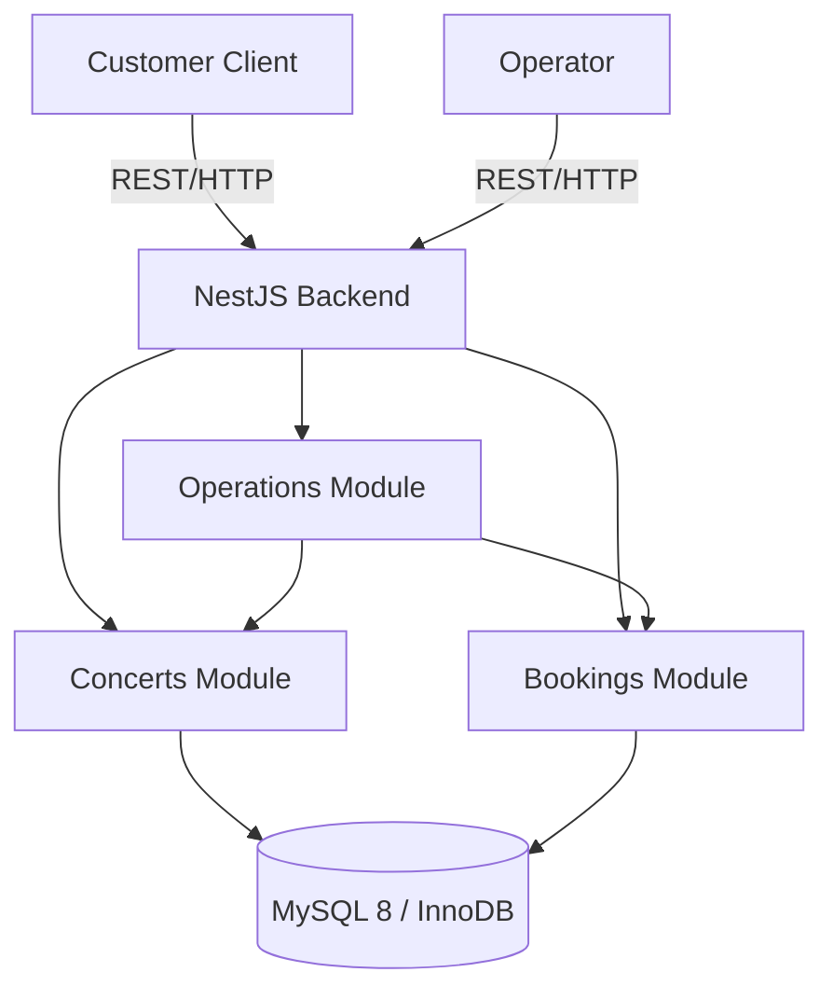
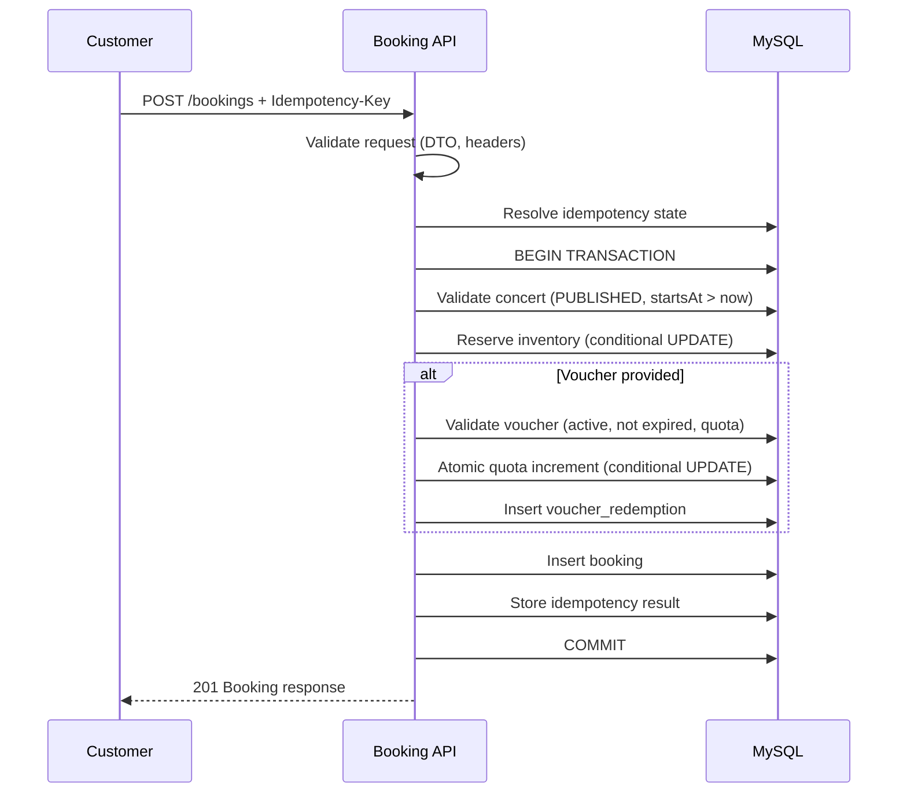
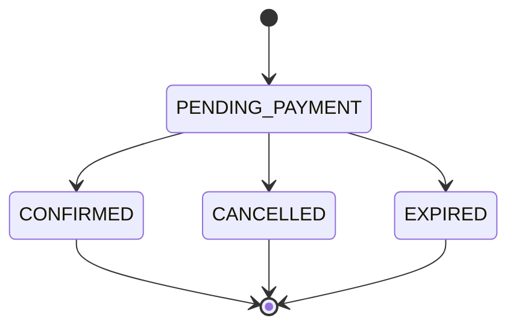
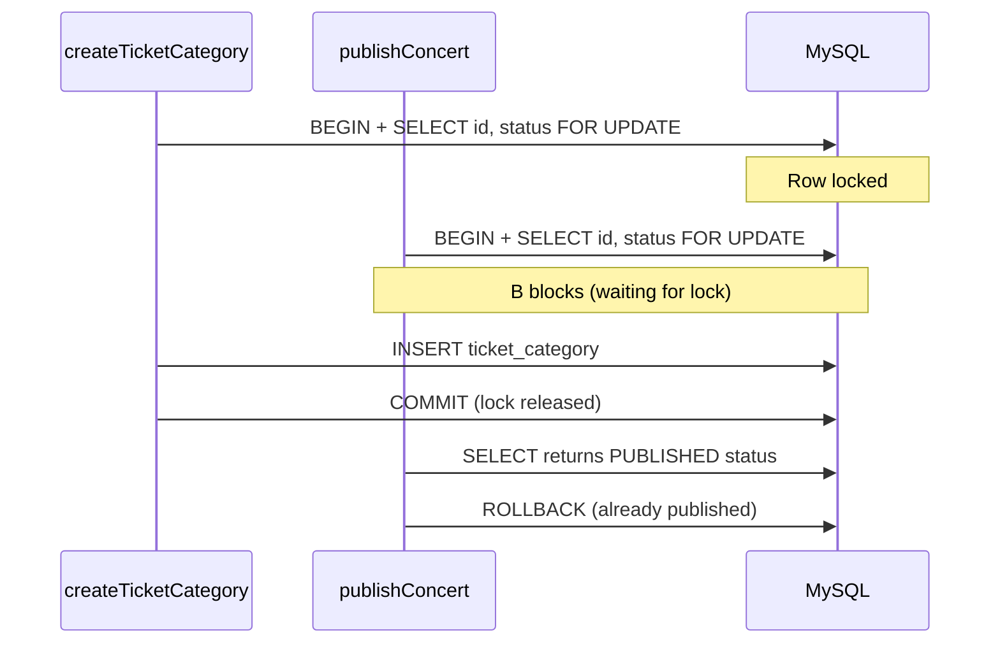

# 01 — System Design

## 1. Purpose

This document describes the **as-built** backend architecture for the Concert Ticket Booking Platform.

The design is optimized for the assessment's highest-risk concerns:

- Prevent ticket overselling.
- Prevent duplicate bookings caused by retries.
- Prevent voucher over-redemption and per-user abuse.
- Keep booking behavior correct during flash-sale traffic spikes.

The implementation intentionally favors **correctness, clear transaction boundaries, and explainability** over infrastructure complexity.

---

## 2. Architecture Summary

**Style:** Modular Monolith

**Stack:** Node.js · TypeScript · NestJS · MySQL 8 / InnoDB · REST · Swagger · Docker Compose



**Key principle:** One deployable backend service with explicit business module boundaries. This keeps transactions simple and business ownership clear.

> **Note:** There is no separate Vouchers module. Voucher validation, quota enforcement, and redemption logic live inside `BookingsService` — co-located with the booking transaction that owns them.

---

## 3. Why Modular Monolith

The main technical risk is not raw request volume — it is **maintaining correct business state when multiple users compete for limited resources**.

A modular monolith keeps:
- Database transactions simple (no distributed sagas).
- Inventory and voucher consistency easy to guarantee.
- Local setup and reviewer reproduction straightforward.
- Integration tests realistic.

Trade-offs accepted:
- Modules cannot be deployed or scaled independently.
- MySQL is a shared dependency.

These trade-offs are acceptable for the assessment workload.

---

## 4. Technology Stack

| Area | Choice | Reason |
|---|---|---|
| Runtime | Node.js | Efficient I/O, strong ecosystem |
| Language | TypeScript | Type safety, maintainability |
| Framework | NestJS | DI, validation, test support |
| Database | MySQL 8 / InnoDB | ACID transactions, row-level locking |
| ORM | Prisma 7 | Type-safe queries, migration management |
| API Style | REST + JSON | Simple, conventional |
| API Docs | Swagger/OpenAPI | Reviewer-friendly |
| Unit Tests | Jest | Native NestJS ecosystem |
| Integration Tests | Supertest | HTTP-level API testing |
| Concurrency Tests | Custom tsx scripts | Flash-sale race condition scenarios |
| Local Environment | Docker Compose | Reproducible setup |
| API Collection | Postman | Manual reviewer validation |

---

## 5. As-Built Module Structure

```text
src/
├── common/
│   ├── auth/           # Guards (UserGuard, OperatorGuard), decorators
│   ├── errors/         # AppException, ErrorCode enum, GlobalExceptionFilter
│   └── request/        # RequestId middleware
│
├── database/
│   └── prisma/         # PrismaService (connection wrapper)
│
├── generated/
│   └── prisma/         # Generated Prisma client (git-ignored)
│
├── health/             # HealthController, HealthService
│
└── modules/
    ├── concerts/       # ConcertsController, ConcertsService
    │   └── dto/
    ├── bookings/       # BookingsController, BookingsService
    │   ├── booking-canonicalize.ts   # Pure: normalizeVoucherCode, createRequestHash
    │   ├── booking-pricing.ts        # Pure: calculateDiscount
    │   └── dto/
    └── operations/     # OperationsController (concerts), OperationsBookingsController
        ├── OperationsService         # Concert/ticket-category/inventory ops
        └── dto/
```

**No repository layer.** Services call `PrismaService` directly. Prisma's typed query API removes the need for an explicit repository abstraction for this scope.

---

## 6. Module Boundaries

### `concerts`
Owns: Concert lifecycle, ticket categories, pricing, inventory, publish rules, customer browsing.

Domain objects: `Concert`, `TicketCategory`

### `bookings`
Owns: Booking creation, idempotency, transaction orchestration, state machine, voucher processing (co-located for transactional correctness), customer and operator booking lookup.

Domain objects: `Booking`, `IdempotencyKey`, `VoucherRedemption`

### `operations`
Exposes operator-facing APIs. Delegates to `BookingsService` and `OperationsService`. Does not own business logic.

---

## 7. Request Layering

```text
HTTP Request
    ↓
Guard (UserGuard / OperatorGuard)
    ↓
Controller  (thin — routing and DTO only)
    ↓
Service     (business rules + transaction orchestration)
    ↓
PrismaService → MySQL
```

Controllers must not own: inventory calculations, voucher quota logic, booking state transitions, or transaction orchestration.

---

## 8. Customer Booking Flow

The booking API is the system's critical path.



If any required step fails: **ROLLBACK** — inventory and voucher state are unchanged.

---

## 9. Inventory Reservation Strategy

**Naive approach (unsafe):**
```sql
SELECT available_quantity  -- Two concurrent requests may both see enough
IF enough: UPDATE          -- Race window between read and write
```

**Implemented approach (atomic conditional update):**
```sql
UPDATE ticket_categories
SET available_quantity = available_quantity - :quantity
WHERE id = :ticketCategoryId
  AND available_quantity >= :quantity
```

- `affectedRows = 1` → reservation succeeded
- `affectedRows = 0` → insufficient inventory

Check and write happen atomically inside MySQL — no application-level race window.

---

## 10. Voucher Strategy

### Global quota protection
```sql
UPDATE vouchers
SET used_count = used_count + 1
WHERE id = :voucherId
  AND status = 'ACTIVE'
  AND used_count < usage_limit
```

If no row is updated, the voucher quota is exhausted.

### Per-user abuse prevention
A `UNIQUE(voucher_id, user_id)` constraint on `voucher_redemptions` is the final concurrency backstop. An optimistic pre-check is performed first (friendly early error), but the constraint is the authoritative protection.

---

## 11. Idempotency Design

```
POST /api/v1/bookings
Idempotency-Key: <client-generated-uuid>
```

| Scenario | Result |
|---|---|
| First request | Process and store result |
| Same key + same payload | Return same logical booking result |
| Same key + different payload | Reject: `IDEMPOTENCY_KEY_CONFLICT` |

Database protection: `UNIQUE(user_id, idempotency_key)` — application-level pre-check alone is insufficient under concurrency.

---

## 12. Booking State Machine



Allowed transitions:
- `PENDING_PAYMENT → CONFIRMED`
- `PENDING_PAYMENT → CANCELLED`
- `PENDING_PAYMENT → EXPIRED`

All other transitions are rejected with `INVALID_BOOKING_STATUS_TRANSITION`.

---

## 13. Operations Flow (TOCTOU Protection)

`createTicketCategory` and `publishConcert` use `SELECT ... FOR UPDATE` on the concert row within a transaction. This serializes concurrent requests and prevents a TOCTOU race where a ticket category is added to an already-published concert.



---

## 14. Error Model

All business errors follow a stable error code contract:

```json
{
  "statusCode": 409,
  "code": "INSUFFICIENT_TICKET_INVENTORY",
  "message": "Not enough tickets are available for this category.",
  "timestamp": "2026-08-08T12:00:00.000Z",
  "path": "/api/v1/bookings"
}
```

Key error codes: `CONCERT_NOT_FOUND`, `CONCERT_NOT_PUBLISHED`, `INSUFFICIENT_TICKET_INVENTORY`, `VOUCHER_NOT_FOUND`, `VOUCHER_EXPIRED`, `VOUCHER_USAGE_LIMIT_REACHED`, `VOUCHER_ALREADY_USED`, `IDEMPOTENCY_KEY_CONFLICT`, `INVALID_BOOKING_STATUS_TRANSITION`.

---

## 15. API Surface

```text
GET    /health

GET    /api/v1/concerts
GET    /api/v1/concerts/:concertId

POST   /api/v1/bookings
GET    /api/v1/bookings/:bookingId
GET    /api/v1/me/bookings

POST   /api/v1/ops/concerts
POST   /api/v1/ops/concerts/:concertId/ticket-categories
POST   /api/v1/ops/concerts/:concertId/publish
GET    /api/v1/ops/concerts/:concertId/inventory

GET    /api/v1/ops/bookings
GET    /api/v1/ops/bookings/:bookingId
PATCH  /api/v1/ops/bookings/:bookingId/status
```

See `04-api-design.md` for full contract details.

---

## 16. Pagination Strategy

| Endpoint | Strategy | Params |
|---|---|---|
| `GET /api/v1/concerts` | Page/offset | `page`, `limit`, `from` |
| `GET /api/v1/me/bookings` | Cursor/keyset | `cursor`, `limit` → `nextCursor` |
| `GET /api/v1/ops/bookings` | Cursor/keyset | `cursor`, `limit`, `concertId`, `status` |

Cursor pagination is used for booking lists because booking IDs are monotonically increasing BIGINTs, making keyset pagination stable and efficient under concurrent inserts.

---

## 17. Reliability Principles

| Code | Principle |
|---|---|
| R-01 | Fail closed on inventory uncertainty — reject the booking |
| R-02 | Database constraints backstop application logic |
| R-03 | Keep transactions short — no external calls inside transactions |
| R-04 | Retried booking requests are safe (idempotency is part of the contract) |
| R-05 | Booking creation either commits fully or rolls back |
| R-06 | Expected business failures return stable error codes |

---

## 18. Testing Strategy

| Layer | Tool | Focus |
|---|---|---|
| Unit | Jest | Pure business logic: discount calculation, voucher normalization, request canonicalization |
| E2E / Integration | Supertest + real MySQL | Critical flows: health, auth, authorization, booking lifecycle, error responses |
| Concurrency | tsx scripts | Overselling, idempotency race, voucher quota race, same-user voucher abuse, cancellation race |

**No mocks for E2E tests.** Real database, real HTTP requests.

---

## 19. Key Architecture Decisions

**ADR-01 — Modular Monolith over Microservices**
Splitting into separate services turns a simple ACID transaction into a distributed consistency problem (sagas, compensation, partial failure). Not justified for the assessment workload.

**ADR-02 — MySQL/InnoDB as authoritative store**
Inventory, booking state, voucher quota, redemption, and idempotency all live in MySQL. Redis is intentionally excluded as an authoritative inventory source to avoid a two-store synchronization problem.

**ADR-03 — Atomic inventory update (conditional UPDATE)**
Avoids read-then-write race conditions at the application level. The database enforces the constraint atomically.

**ADR-04 — Idempotency-Key for booking creation**
Network retries must not create duplicate bookings. Database-level `UNIQUE(user_id, idempotency_key)` is the safety net.

**ADR-05 — Voucher logic co-located with BookingsService**
Voucher reservation, quota decrement, and redemption record must participate in the same database transaction as inventory decrement and booking creation. A separate VouchersService would complicate transaction ownership without adding value at this scale.

---

## 20. Architecture Guarantees

The implementation is designed to make these statements demonstrably true — verified by concurrency tests:

1. Ticket inventory never becomes negative.
2. Concurrent requests cannot reserve more tickets than are available.
3. Retrying the same logical booking request does not create a duplicate booking.
4. Voucher global quota cannot be exceeded by concurrent redemptions.
5. A single user cannot redeem the same voucher more than once, even under concurrent attempts.
6. Booking creation is atomic — either fully committed or fully rolled back.
7. Invalid booking status transitions are rejected.
8. Critical state is never stored only in Node.js process memory.