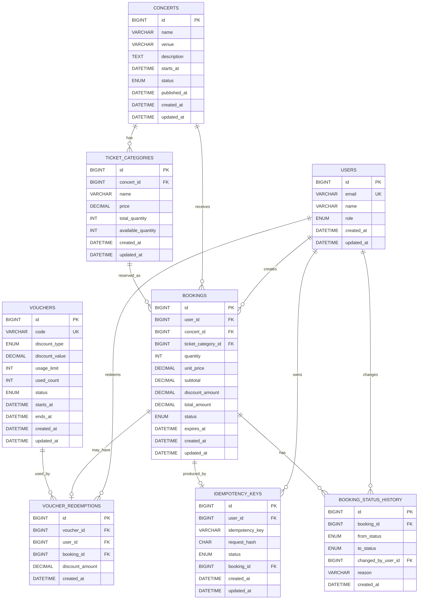

# 02 — Database Design

## 1. Purpose

This document defines the MySQL database design for the **Concert Ticket Booking Platform**.

The database is designed around the assessment's most important backend risks:

- Prevent ticket overselling.
- Prevent duplicate bookings caused by retries.
- Prevent voucher over-redemption and repeated use.
- Keep booking creation atomic.
- Support customer booking lookup and operation monitoring.
- Preserve enough history to explain operational changes.

The design intentionally favors **strong transactional correctness and simple, explainable constraints** over distributed-data complexity.

---

## 2. Source Alignment vs. Implementation Decisions

The assessment explicitly requires a backend supporting customer booking flows and internal operation workflows, and explicitly calls out these risks:

- Limited ticket quantity.
- Limited voucher quantity.
- Overselling.
- Duplicate bookings caused by retries.
- Voucher abuse.
- Flash-sale instability.

The assessment does **not** define a complete relational schema, status model, voucher policy, payment workflow, or seat-level model.

Therefore, the schema below contains implementation assumptions documented in `00-scope-and-assumptions.md`.

Key assumptions used by this design:

```text
- Tickets are category-based, not assigned-seat based.
- One booking contains one ticket category.
- One booking may apply at most one voucher.
- One user may use the same voucher at most once.
- Real payment gateway integration is out of scope.
- A successful reservation begins as PENDING_PAYMENT.
- MySQL/InnoDB is the authoritative transactional data store.
- Full authentication/RBAC is out of scope, but users have roles for testability.
```

---

## 3. Database Technology

### Selected database

```text
MySQL 8.x
Storage Engine: InnoDB
```

### Why MySQL/InnoDB

The booking domain requires:

- ACID transactions.
- Row-level locking.
- Unique constraints.
- Foreign keys.
- Atomic conditional updates.
- Reliable rollback behavior.
- Mature indexing.

This is sufficient for the expected assessment traffic and avoids introducing a second authoritative store.

---

## 4. Design Principles

### DB-01 — MySQL is the source of truth

Critical state must not exist only in Node.js memory or cache.

Authoritative data includes:

```text
ticket inventory
booking state
voucher quota
voucher redemption
idempotency result
```

### DB-02 — Critical invariants are enforced close to the database

Application validation is useful, but concurrency-sensitive rules must also be protected with:

```text
atomic UPDATE
UNIQUE constraints
FOREIGN KEY constraints
transactions
row locks where needed
```

### DB-03 — No read-then-write inventory logic

Avoid:

```text
SELECT available_quantity
if enough:
    UPDATE available_quantity
```

for concurrent inventory decisions.

### DB-04 — Transactional records are not hard-deleted

Bookings, voucher redemptions, idempotency records, and booking status history are preserved for traceability.

### DB-05 — Store price snapshots on bookings

Historical bookings must not change if ticket pricing changes later.

### DB-06 — Keep transactions short

No email, SMS, HTTP request, payment provider call, or other remote I/O belongs inside a critical booking transaction.

---

## 5. Entity Relationship Diagram



---

## 6. Table Summary

The initial schema contains eight tables:

```text
users
concerts
ticket_categories
bookings
vouchers
voucher_redemptions
idempotency_keys
booking_status_history
```

Each table exists for a concrete business reason.

| Table | Main purpose |
|---|---|
| `users` | Customer/operator identity for booking, voucher, and audit rules |
| `concerts` | Concert metadata and publication state |
| `ticket_categories` | Ticket category, price, and inventory source of truth |
| `bookings` | Reservation and historical price snapshot |
| `vouchers` | Voucher rules, active window, and global quota |
| `voucher_redemptions` | Per-user voucher usage and booking linkage |
| `idempotency_keys` | Retry deduplication for booking creation |
| `booking_status_history` | Audit trail for booking status changes |

---

# 7. `users`

## Purpose

Represents both customers and operators.

Authentication is not a core assessment feature, but a user identity is required to enforce:

```text
booking ownership
voucher per-user limits
idempotency scope
operation audit history
```

## Proposed columns

| Column | Type | Null | Notes |
|---|---|---:|---|
| `id` | `BIGINT UNSIGNED` | No | Primary key, auto increment |
| `email` | `VARCHAR(255)` | No | Normalized to lowercase in application |
| `name` | `VARCHAR(120)` | No | Display name |
| `role` | `ENUM('CUSTOMER','OPERATOR')` | No | Logical actor type |
| `created_at` | `DATETIME(3)` | No | UTC |
| `updated_at` | `DATETIME(3)` | No | UTC |

## Constraints

```text
PRIMARY KEY (id)
UNIQUE (email)
```

## Indexes

The unique email index is sufficient for the current scope.

A standalone index on `role` is not required unless operator/user list queries are added later.

## Notes

The project does not implement a complete IAM system.

Seeded users can be used to simulate customers/operators during testing.

---

# 8. `concerts`

## Purpose

Stores concert metadata and publication state.

## Proposed columns

| Column | Type | Null | Notes |
|---|---|---:|---|
| `id` | `BIGINT UNSIGNED` | No | Primary key |
| `name` | `VARCHAR(200)` | No | Concert name |
| `venue` | `VARCHAR(255)` | No | Venue |
| `description` | `TEXT` | Yes | Optional description |
| `starts_at` | `DATETIME(3)` | No | UTC |
| `status` | `ENUM('DRAFT','PUBLISHED','CANCELLED')` | No | Default `DRAFT` |
| `published_at` | `DATETIME(3)` | Yes | Set when published |
| `created_at` | `DATETIME(3)` | No | UTC |
| `updated_at` | `DATETIME(3)` | No | UTC |

## Constraints

```text
PRIMARY KEY (id)
```

## Important indexes

```text
INDEX idx_concerts_status_starts_at (status, starts_at, id)
```

### Why

Customer browse flow primarily queries:

```text
status = PUBLISHED
ordered/filter by starts_at
```

The trailing `id` gives deterministic ordering for equal timestamps and is useful for future keyset pagination.

## Business rule

Only:

```text
status = PUBLISHED
```

accepts new bookings.

---

# 9. `ticket_categories`

## Purpose

Stores categories such as:

```text
VIP
Standard
Economy
```

and is the authoritative source of ticket inventory.

## Proposed columns

| Column | Type | Null | Notes |
|---|---|---:|---|
| `id` | `BIGINT UNSIGNED` | No | Primary key |
| `concert_id` | `BIGINT UNSIGNED` | No | FK to concert |
| `name` | `VARCHAR(100)` | No | Category name |
| `price` | `DECIMAL(15,2)` | No | Server-authoritative price |
| `total_quantity` | `INT UNSIGNED` | No | Configured inventory |
| `available_quantity` | `INT UNSIGNED` | No | Reservable inventory |
| `created_at` | `DATETIME(3)` | No | UTC |
| `updated_at` | `DATETIME(3)` | No | UTC |

## Constraints

```text
PRIMARY KEY (id)

FOREIGN KEY (concert_id)
    REFERENCES concerts(id)
    ON DELETE RESTRICT

UNIQUE (concert_id, name)

CHECK (price >= 0)
CHECK (available_quantity <= total_quantity)
```

`INT UNSIGNED` already prevents negative values at storage level.

## Important indexes

```text
UNIQUE uq_ticket_categories_concert_name (concert_id, name)

INDEX idx_ticket_categories_concert_id (concert_id, id)
```

Depending on MySQL's chosen access path, the unique composite index already begins with `concert_id` and may make the second index unnecessary.

During implementation, avoid keeping redundant indexes that provide no additional query benefit.

---

## 9.1 Why both `total_quantity` and `available_quantity`

`total_quantity` is the configured capacity.

`available_quantity` changes during reservation/release.

Example:

```text
total_quantity     = 100
available_quantity = 17
```

This makes reads cheap and allows the critical reservation operation to be a single atomic update.

---

## 9.2 Overselling protection

The reservation path uses:

```sql
UPDATE ticket_categories
SET available_quantity = available_quantity - :quantity
WHERE id = :ticketCategoryId
  AND available_quantity >= :quantity;
```

Interpretation:

```text
affectedRows = 1
→ reservation succeeded

affectedRows = 0
→ insufficient inventory
```

This protects the inventory even when multiple Node.js instances issue concurrent requests.

---

# 10. `bookings`

## Purpose

Represents a ticket reservation.

For the assessment scope:

```text
one booking = one ticket category
```

This avoids unnecessary `booking_items` complexity while keeping the critical concurrency problem intact.

## Proposed columns

| Column | Type | Null | Notes |
|---|---|---:|---|
| `id` | `BIGINT UNSIGNED` | No | Primary key |
| `user_id` | `BIGINT UNSIGNED` | No | Booking owner |
| `concert_id` | `BIGINT UNSIGNED` | No | Concert snapshot relation |
| `ticket_category_id` | `BIGINT UNSIGNED` | No | Reserved category |
| `quantity` | `INT UNSIGNED` | No | Number of tickets |
| `unit_price` | `DECIMAL(15,2)` | No | Price snapshot |
| `subtotal` | `DECIMAL(15,2)` | No | `unit_price * quantity` |
| `discount_amount` | `DECIMAL(15,2)` | No | Default `0` |
| `total_amount` | `DECIMAL(15,2)` | No | Final amount |
| `status` | `ENUM('PENDING_PAYMENT','CONFIRMED','CANCELLED','EXPIRED')` | No | Initial state `PENDING_PAYMENT` |
| `expires_at` | `DATETIME(3)` | Yes | Reservation expiry |
| `created_at` | `DATETIME(3)` | No | UTC |
| `updated_at` | `DATETIME(3)` | No | UTC |

## Constraints

```text
PRIMARY KEY (id)

FOREIGN KEY (user_id)
    REFERENCES users(id)
    ON DELETE RESTRICT

FOREIGN KEY (concert_id)
    REFERENCES concerts(id)
    ON DELETE RESTRICT

FOREIGN KEY (ticket_category_id)
    REFERENCES ticket_categories(id)
    ON DELETE RESTRICT

CHECK (quantity >= 1 AND quantity <= 10)

CHECK (unit_price >= 0)
CHECK (subtotal >= 0)
CHECK (discount_amount >= 0)
CHECK (discount_amount <= subtotal)
CHECK (total_amount >= 0)
CHECK (total_amount = subtotal - discount_amount)
```

The maximum quantity of `10` comes from the explicit assessment assumption in `00-scope-and-assumptions.md`.

---

## 10.1 Why store `unit_price`, `subtotal`, `discount_amount`, and `total_amount`

A booking is a historical business record.

Suppose:

```text
VIP price today = 2,000,000
VIP price tomorrow = 2,500,000
```

An old booking must still show the amount agreed at creation time.

Therefore, the booking stores immutable pricing snapshots rather than recomputing historical totals from the current ticket category.

---

## 10.2 Booking indexes

### Customer booking history

```text
INDEX idx_bookings_user_created
(user_id, created_at, id)
```

Supports:

```text
GET /api/v1/me/bookings
```

### Operation booking monitor

```text
INDEX idx_bookings_status_created
(status, created_at, id)
```

Supports:

```text
GET /api/v1/ops/bookings?status=...
```

### Concert-level operation view

```text
INDEX idx_bookings_concert_created
(concert_id, created_at, id)
```

Useful for monitoring bookings for a specific concert.

### Ticket-category level debugging

A standalone `ticket_category_id` index may be added only if actual query patterns require it.

Do not create indexes only because a column is present.

---

# 11. `vouchers`

## Purpose

Stores voucher campaign rules and global quota.

## Proposed columns

| Column | Type | Null | Notes |
|---|---|---:|---|
| `id` | `BIGINT UNSIGNED` | No | Primary key |
| `code` | `VARCHAR(64)` | No | Normalize to uppercase |
| `discount_type` | `ENUM('PERCENTAGE','FIXED_AMOUNT')` | No | Discount strategy |
| `discount_value` | `DECIMAL(15,2)` | No | Percentage or fixed value |
| `usage_limit` | `INT UNSIGNED` | No | Campaign maximum |
| `used_count` | `INT UNSIGNED` | No | Default `0` |
| `status` | `ENUM('ACTIVE','INACTIVE')` | No | Campaign switch |
| `starts_at` | `DATETIME(3)` | No | UTC |
| `ends_at` | `DATETIME(3)` | No | UTC |
| `created_at` | `DATETIME(3)` | No | UTC |
| `updated_at` | `DATETIME(3)` | No | UTC |

## Constraints

```text
PRIMARY KEY (id)

UNIQUE (code)

CHECK (discount_value > 0)

CHECK (
    (discount_type = 'PERCENTAGE' AND discount_value <= 100)
    OR
    (discount_type = 'FIXED_AMOUNT')
)

CHECK (usage_limit > 0)
CHECK (used_count <= usage_limit)
CHECK (starts_at < ends_at)
```

`INT UNSIGNED` prevents negative counters.

---

## 11.1 Voucher code normalization

Application behavior:

```text
"geek50"
"GEEK50"
"Geek50"
```

are normalized to:

```text
GEEK50
```

before persistence/query.

This makes the business rule explicit instead of depending accidentally on database collation behavior.

---

## 11.2 Voucher quota protection

Conceptual atomic update:

```sql
UPDATE vouchers
SET used_count = used_count + 1
WHERE code = :normalizedCode
  AND status = 'ACTIVE'
  AND starts_at <= UTC_TIMESTAMP(3)
  AND ends_at > UTC_TIMESTAMP(3)
  AND used_count < usage_limit;
```

Interpretation:

```text
affectedRows = 1
→ one quota unit reserved

affectedRows = 0
→ voucher invalid/inactive/expired/exhausted
```

The update runs inside the same transaction as the booking.

If later steps fail, the whole transaction rolls back, including `used_count`.

---

# 12. `voucher_redemptions`

## Purpose

Records which user applied which voucher to which booking.

This table supports the assessment concern around voucher abuse.

## Proposed columns

| Column | Type | Null | Notes |
|---|---|---:|---|
| `id` | `BIGINT UNSIGNED` | No | Primary key |
| `voucher_id` | `BIGINT UNSIGNED` | No | FK |
| `user_id` | `BIGINT UNSIGNED` | No | FK |
| `booking_id` | `BIGINT UNSIGNED` | No | FK |
| `discount_amount` | `DECIMAL(15,2)` | No | Applied discount snapshot |
| `created_at` | `DATETIME(3)` | No | UTC |

## Constraints

```text
PRIMARY KEY (id)

FOREIGN KEY (voucher_id)
    REFERENCES vouchers(id)
    ON DELETE RESTRICT

FOREIGN KEY (user_id)
    REFERENCES users(id)
    ON DELETE RESTRICT

FOREIGN KEY (booking_id)
    REFERENCES bookings(id)
    ON DELETE RESTRICT

UNIQUE (voucher_id, user_id)

UNIQUE (booking_id)

CHECK (discount_amount >= 0)
```

---

## 12.1 Why `UNIQUE(voucher_id, user_id)`

The assessment does not define a per-user voucher policy.

This implementation explicitly assumes:

```text
one user can successfully use the same voucher at most once
```

The unique constraint makes that rule concurrency-safe.

Two requests from the same user cannot both create a successful redemption even if they race.

---

## 12.2 Why `UNIQUE(booking_id)`

The assessment scope supports:

```text
0 or 1 voucher per booking
```

This unique constraint guarantees that at database level.

---

## 12.3 Voucher cancellation policy

For this assessment, a successfully applied voucher consumes campaign quota when the reservation is created.

If the booking later becomes `CANCELLED` or `EXPIRED`:

```text
ticket inventory is released
voucher quota is NOT restored
voucher redemption history is preserved
```

### Reason

The assessment does not define voucher restoration/refund rules.

Keeping redemption consumed is a conservative anti-abuse rule and avoids adding a second voucher lifecycle to a payment flow that is intentionally out of scope.

This is a deliberate assumption, not a universal production policy.

A real product may choose to release voucher quota after payment timeout or cancellation.

---

# 13. `idempotency_keys`

## Purpose

Prevents retries from creating duplicate bookings.

## Proposed columns

| Column | Type | Null | Notes |
|---|---|---:|---|
| `id` | `BIGINT UNSIGNED` | No | Primary key |
| `user_id` | `BIGINT UNSIGNED` | No | Retry scope |
| `idempotency_key` | `VARCHAR(128)` | No | Exact client key |
| `request_hash` | `CHAR(64)` | No | SHA-256 hex |
| `status` | `ENUM('PROCESSING','COMPLETED')` | No | Transaction lifecycle |
| `booking_id` | `BIGINT UNSIGNED` | Yes | Set before successful commit |
| `created_at` | `DATETIME(3)` | No | UTC |
| `updated_at` | `DATETIME(3)` | No | UTC |

## Constraints

```text
PRIMARY KEY (id)

FOREIGN KEY (user_id)
    REFERENCES users(id)
    ON DELETE RESTRICT

FOREIGN KEY (booking_id)
    REFERENCES bookings(id)
    ON DELETE RESTRICT

UNIQUE (user_id, idempotency_key)

UNIQUE (booking_id)
```

The `booking_id` unique constraint allows multiple `NULL` values in MySQL but guarantees one idempotency record per completed booking.

---

## 13.1 Idempotency key comparison

Idempotency keys should be treated as exact tokens.

Recommended implementation:

```text
normalize: do not lowercase/uppercase
comparison: exact
length limit: 128
```

When using raw migrations, a binary/case-sensitive collation can be used for the column if desired.

---

## 13.2 Request hash

The server calculates a SHA-256 hash from the canonical booking request.

Example canonical fields:

```text
userId
concertId
ticketCategoryId
quantity
normalizedVoucherCode
```

Do not include:

```text
request timestamp
requestId
random values
HTTP metadata unrelated to booking semantics
```

Expected behavior:

### Same key + same hash

```text
return the previously created booking result
```

### Same key + different hash

```text
IDEMPOTENCY_KEY_CONFLICT
```

---

## 13.3 Concurrent same-key behavior

The unique index:

```text
UNIQUE(user_id, idempotency_key)
```

serializes competing inserts for the same logical key.

Expected flow:

```text
Request A inserts key
Request B attempts same key
Request B waits/fails on unique-key conflict
Request A completes transaction
Request B reads committed idempotency result
```

If Request A rolls back:

```text
its idempotency insert also rolls back
```

so a later retry may safely process the request.

---

# 14. `booking_status_history`

## Purpose

Records operational status changes.

This is useful because the operation dashboard can manually change booking status.

## Proposed columns

| Column | Type | Null | Notes |
|---|---|---:|---|
| `id` | `BIGINT UNSIGNED` | No | Primary key |
| `booking_id` | `BIGINT UNSIGNED` | No | FK |
| `from_status` | Booking status enum | Yes | `NULL` for initial creation |
| `to_status` | Booking status enum | No | New status |
| `changed_by_user_id` | `BIGINT UNSIGNED` | Yes | Operator/system actor |
| `reason` | `VARCHAR(255)` | Yes | Optional operation note |
| `created_at` | `DATETIME(3)` | No | UTC |

## Constraints

```text
PRIMARY KEY (id)

FOREIGN KEY (booking_id)
    REFERENCES bookings(id)
    ON DELETE RESTRICT

FOREIGN KEY (changed_by_user_id)
    REFERENCES users(id)
    ON DELETE RESTRICT
```

`changed_by_user_id` is nullable so system-created initial entries can be represented without inventing a fake user.

## Index

```text
INDEX idx_booking_status_history_booking_created
(booking_id, created_at, id)
```

---

# 15. Booking State Transition Data Rules

Allowed transitions:

```text
PENDING_PAYMENT -> CONFIRMED
PENDING_PAYMENT -> CANCELLED
PENDING_PAYMENT -> EXPIRED
```

Terminal states:

```text
CONFIRMED
CANCELLED
EXPIRED
```

Invalid examples:

```text
CONFIRMED -> PENDING_PAYMENT
CANCELLED -> CONFIRMED
EXPIRED -> CONFIRMED
```

The transition matrix is primarily an application business rule.

However, transition writes must still be concurrency-safe.

---

## 15.1 Concurrent status update protection

Avoid:

```text
SELECT status
if valid:
    UPDATE status
```

without locking.

Preferred approach:

```text
BEGIN
SELECT booking ... FOR UPDATE
validate transition
apply status update
apply inventory release if required
insert status history
COMMIT
```

The booking row lock ensures only one status transition is processed at a time.

---

# 16. Inventory Lifecycle

## On booking creation

A successful `PENDING_PAYMENT` reservation decrements:

```text
ticket_categories.available_quantity
```

inside the booking transaction.

## On confirmation

```text
PENDING_PAYMENT -> CONFIRMED
```

does not change inventory because the ticket was already reserved.

## On cancellation / expiration

```text
PENDING_PAYMENT -> CANCELLED
PENDING_PAYMENT -> EXPIRED
```

must restore inventory:

```sql
UPDATE ticket_categories
SET available_quantity = available_quantity + :bookingQuantity
WHERE id = :ticketCategoryId;
```

This update runs in the **same transaction** as the successful status transition.

---

## 16.1 Why inventory release must be transactional

Forbidden state:

```text
booking = CANCELLED
inventory still deducted
```

or:

```text
inventory restored
booking still PENDING_PAYMENT
```

The status change and inventory release must either both commit or both roll back.

---

# 17. Critical Booking Transaction

The intended transaction order is deliberately stable to reduce deadlock risk.

```text
BEGIN

1. Insert/resolve idempotency row

2. Read concert + ticket category metadata
   - verify concert exists
   - verify concert is PUBLISHED
   - verify category belongs to concert
   - read server-authoritative price

3. Atomic ticket inventory UPDATE

4. If voucher provided:
   - normalize code
   - atomic voucher quota UPDATE
   - read voucher discount data

5. Calculate server-side pricing

6. Insert booking

7. If voucher provided:
   - insert voucher_redemption
   - UNIQUE(voucher_id, user_id) protects per-user rule

8. Insert initial booking_status_history
   NULL -> PENDING_PAYMENT

9. Update idempotency row to COMPLETED + booking_id

COMMIT
```

Any failure:

```text
ROLLBACK
```

---

# 18. Why the Transaction Order Matters

High-concurrency systems can deadlock if transactions acquire locks in inconsistent order.

The booking path always aims to lock resources in the same order:

```text
idempotency identity
→ ticket category
→ voucher
→ booking-related rows
```

This does not mathematically eliminate every possible deadlock, but it reduces avoidable lock-order inversions.

---

# 19. Deadlock Handling

InnoDB may legitimately detect a deadlock under concurrency.

The application must not treat every deadlock as a permanent business failure.

Recommended behavior for the critical booking transaction:

```text
MySQL deadlock detected
→ rollback
→ retry transaction a small bounded number of times
→ add short randomized backoff
```

Example policy:

```text
max retries: 2
small jitter/backoff between retries
```

Do **not** use unlimited retries.

If retry budget is exhausted, return a controlled server error and allow the client to retry with the same idempotency key.

---

# 20. Lock Wait Handling

If a transaction exceeds a reasonable lock wait:

```text
rollback
return controlled transient failure
```

Do not keep an HTTP request blocked indefinitely.

The actual timeout value should be configured and measured rather than chosen arbitrarily in this design document.

---

# 21. MySQL Isolation Level

The design does not depend on weak application-level read consistency for critical invariants.

Correctness is provided by:

```text
atomic conditional updates
unique constraints
explicit transactions
row locks for status transitions
```

Therefore, the initial implementation can keep MySQL/InnoDB's standard isolation configuration rather than introducing a custom isolation level without evidence.

If contention/gap-lock behavior becomes measurable later, isolation tuning can be evaluated with benchmarks.

---

# 22. Money Representation

Never use:

```text
FLOAT
DOUBLE
```

for monetary values.

Use:

```text
DECIMAL(15,2)
```

for:

```text
ticket price
booking subtotal
discount amount
booking total
voucher fixed discount
```

The current assessment assumes a single currency.

Multi-currency pricing is intentionally out of scope.

---

# 23. Time Representation

MySQL `DATETIME` does not carry a timezone.

Application policy:

```text
all timestamps are written in UTC
all timestamps are compared in UTC
API responses use ISO 8601 UTC timestamps
```

Use:

```text
DATETIME(3)
```

to preserve millisecond precision for debugging/concurrency traces.

---

# 24. Primary Key Strategy

Use:

```text
BIGINT UNSIGNED AUTO_INCREMENT
```

for initial primary keys.

### Reason

For the assessment this is:

- Simple.
- Compact.
- Efficient for InnoDB clustered indexes.
- Easy to inspect while debugging.
- Easy to explain.

UUID/ULID can be introduced later if external ID unpredictability or distributed ID generation becomes a concrete requirement.

---

# 25. Foreign Key Strategy

Core business references use InnoDB foreign keys.

Examples:

```text
ticket_categories.concert_id -> concerts.id

bookings.user_id -> users.id
bookings.concert_id -> concerts.id
bookings.ticket_category_id -> ticket_categories.id

voucher_redemptions.voucher_id -> vouchers.id
voucher_redemptions.user_id -> users.id
voucher_redemptions.booking_id -> bookings.id

idempotency_keys.user_id -> users.id
idempotency_keys.booking_id -> bookings.id

booking_status_history.booking_id -> bookings.id
```

### Delete policy

Use:

```text
ON DELETE RESTRICT
```

for transactional/domain records.

The system does not implement hard deletion for bookings, redemptions, concerts in use, or vouchers in use.

Status changes are preferred over destructive deletion.

---

# 26. Index Strategy

Indexes exist to support real query patterns.

Do not create an index for every column.

## Planned indexes

### Concert browse

```text
concerts(status, starts_at, id)
```

### Ticket categories by concert

Provided by:

```text
UNIQUE(concert_id, name)
```

which already has `concert_id` as its leftmost prefix.

### Customer booking list

```text
bookings(user_id, created_at, id)
```

### Operation booking status monitor

```text
bookings(status, created_at, id)
```

### Concert booking monitor

```text
bookings(concert_id, created_at, id)
```

### Voucher lookup

```text
UNIQUE(vouchers.code)
```

### Per-user voucher protection

```text
UNIQUE(voucher_redemptions.voucher_id, voucher_redemptions.user_id)
```

### One voucher per booking

```text
UNIQUE(voucher_redemptions.booking_id)
```

### Idempotency lookup

```text
UNIQUE(idempotency_keys.user_id, idempotency_keys.idempotency_key)
```

### Booking history

```text
booking_status_history(booking_id, created_at, id)
```

---

# 27. Pagination Considerations

Initial APIs may use:

```text
page
limit
```

because the assessment data size is moderate.

Indexes still include deterministic trailing fields such as:

```text
created_at, id
```

so the system can later migrate to keyset/cursor pagination without redesigning the schema.

---

# 28. Query Patterns

## Customer: browse published concerts

Conceptual query:

```sql
SELECT ...
FROM concerts
WHERE status = 'PUBLISHED'
  AND starts_at >= :from
ORDER BY starts_at ASC, id ASC
LIMIT :limit OFFSET :offset;
```

Supported by:

```text
(status, starts_at, id)
```

---

## Customer: view ticket categories

```sql
SELECT ...
FROM ticket_categories
WHERE concert_id = :concertId
ORDER BY id;
```

---

## Customer: booking history

```sql
SELECT ...
FROM bookings
WHERE user_id = :userId
ORDER BY created_at DESC, id DESC
LIMIT :limit OFFSET :offset;
```

Supported by:

```text
(user_id, created_at, id)
```

---

## Operator: monitor booking status

```sql
SELECT ...
FROM bookings
WHERE status = :status
ORDER BY created_at DESC, id DESC
LIMIT :limit OFFSET :offset;
```

Supported by:

```text
(status, created_at, id)
```

---

# 29. Database Protection Matrix

This is the most important summary of the schema.

| Business risk | Database protection |
|---|---|
| Overselling | Atomic conditional inventory `UPDATE` |
| Negative inventory | `UNSIGNED` + availability check |
| Inventory > total | `CHECK (available_quantity <= total_quantity)` |
| Duplicate booking retry | `UNIQUE(user_id, idempotency_key)` + transaction |
| Same key with changed payload | Persisted `request_hash` |
| Voucher quota overflow | Atomic conditional voucher `UPDATE` |
| Same voucher reused by user | `UNIQUE(voucher_id, user_id)` |
| Multiple vouchers on one booking | `UNIQUE(booking_id)` on redemption |
| Partial booking writes | Single ACID transaction |
| Orphan booking references | Foreign keys |
| Concurrent booking status changes | `SELECT ... FOR UPDATE` |
| Double inventory release | Status row lock + one valid transition |
| Historical price mutation | Price snapshots in `bookings` |
| Untraceable manual status change | `booking_status_history` |

---

# 30. Invariant-to-Schema Mapping

## INV-01 — Inventory never becomes negative

Protected by:

```text
INT UNSIGNED
atomic conditional UPDATE
```

Tested with concurrent booking requests.

---

## INV-02 — Successful reservations never exceed inventory

Protected by:

```text
UPDATE ... WHERE available_quantity >= requested_quantity
```

No separate application read decides availability.

---

## INV-03 — Retry does not create duplicate booking

Protected by:

```text
UNIQUE(user_id, idempotency_key)
request_hash
transaction
```

---

## INV-04 — Voucher quota is never exceeded

Protected by:

```text
UPDATE vouchers
SET used_count = used_count + 1
WHERE used_count < usage_limit
```

inside the booking transaction.

---

## INV-05 — One user cannot reuse the same voucher

Protected by:

```text
UNIQUE(voucher_id, user_id)
```

---

## INV-06 — Booking creation is atomic

Protected by:

```text
InnoDB transaction
ROLLBACK on any failure
```

---

## INV-07 — Booking status transitions are valid

Protected by:

```text
application transition matrix
+
booking row lock
+
same transaction for status/history/inventory release
```

---

## INV-08 — Only published concerts can be booked

Protected primarily by application/business validation using authoritative database state.

Concert cancellation during an already in-flight booking is outside the initial concurrent-operation scope.

A production system requiring strict cancellation-vs-booking exclusion would introduce stronger coordination around concert lifecycle changes.

---

# 31. Sample MySQL DDL

The actual implementation should be generated through migrations, but the following DDL illustrates the intended schema.

```sql
CREATE TABLE users (
    id BIGINT UNSIGNED NOT NULL AUTO_INCREMENT,
    email VARCHAR(255) NOT NULL,
    name VARCHAR(120) NOT NULL,
    role ENUM('CUSTOMER', 'OPERATOR') NOT NULL,
    created_at DATETIME(3) NOT NULL DEFAULT CURRENT_TIMESTAMP(3),
    updated_at DATETIME(3) NOT NULL DEFAULT CURRENT_TIMESTAMP(3)
        ON UPDATE CURRENT_TIMESTAMP(3),

    PRIMARY KEY (id),
    UNIQUE KEY uq_users_email (email)
) ENGINE=InnoDB;
```

```sql
CREATE TABLE concerts (
    id BIGINT UNSIGNED NOT NULL AUTO_INCREMENT,
    name VARCHAR(200) NOT NULL,
    venue VARCHAR(255) NOT NULL,
    description TEXT NULL,
    starts_at DATETIME(3) NOT NULL,
    status ENUM('DRAFT', 'PUBLISHED', 'CANCELLED')
        NOT NULL DEFAULT 'DRAFT',
    published_at DATETIME(3) NULL,
    created_at DATETIME(3) NOT NULL DEFAULT CURRENT_TIMESTAMP(3),
    updated_at DATETIME(3) NOT NULL DEFAULT CURRENT_TIMESTAMP(3)
        ON UPDATE CURRENT_TIMESTAMP(3),

    PRIMARY KEY (id),
    KEY idx_concerts_status_starts_at (status, starts_at, id)
) ENGINE=InnoDB;
```

```sql
CREATE TABLE ticket_categories (
    id BIGINT UNSIGNED NOT NULL AUTO_INCREMENT,
    concert_id BIGINT UNSIGNED NOT NULL,
    name VARCHAR(100) NOT NULL,
    price DECIMAL(15,2) NOT NULL,
    total_quantity INT UNSIGNED NOT NULL,
    available_quantity INT UNSIGNED NOT NULL,
    created_at DATETIME(3) NOT NULL DEFAULT CURRENT_TIMESTAMP(3),
    updated_at DATETIME(3) NOT NULL DEFAULT CURRENT_TIMESTAMP(3)
        ON UPDATE CURRENT_TIMESTAMP(3),

    PRIMARY KEY (id),
    UNIQUE KEY uq_ticket_categories_concert_name (concert_id, name),

    CONSTRAINT fk_ticket_categories_concert
        FOREIGN KEY (concert_id)
        REFERENCES concerts(id)
        ON DELETE RESTRICT,

    CONSTRAINT chk_ticket_categories_price
        CHECK (price >= 0),

    CONSTRAINT chk_ticket_categories_available
        CHECK (available_quantity <= total_quantity)
) ENGINE=InnoDB;
```

```sql
CREATE TABLE vouchers (
    id BIGINT UNSIGNED NOT NULL AUTO_INCREMENT,
    code VARCHAR(64) NOT NULL,
    discount_type ENUM('PERCENTAGE', 'FIXED_AMOUNT') NOT NULL,
    discount_value DECIMAL(15,2) NOT NULL,
    usage_limit INT UNSIGNED NOT NULL,
    used_count INT UNSIGNED NOT NULL DEFAULT 0,
    status ENUM('ACTIVE', 'INACTIVE') NOT NULL DEFAULT 'ACTIVE',
    starts_at DATETIME(3) NOT NULL,
    ends_at DATETIME(3) NOT NULL,
    created_at DATETIME(3) NOT NULL DEFAULT CURRENT_TIMESTAMP(3),
    updated_at DATETIME(3) NOT NULL DEFAULT CURRENT_TIMESTAMP(3)
        ON UPDATE CURRENT_TIMESTAMP(3),

    PRIMARY KEY (id),
    UNIQUE KEY uq_vouchers_code (code),

    CONSTRAINT chk_vouchers_discount_value
        CHECK (discount_value > 0),

    CONSTRAINT chk_vouchers_percentage
        CHECK (
            discount_type <> 'PERCENTAGE'
            OR discount_value <= 100
        ),

    CONSTRAINT chk_vouchers_usage_limit
        CHECK (usage_limit > 0),

    CONSTRAINT chk_vouchers_used_count
        CHECK (used_count <= usage_limit),

    CONSTRAINT chk_vouchers_time_window
        CHECK (starts_at < ends_at)
) ENGINE=InnoDB;
```

```sql
CREATE TABLE bookings (
    id BIGINT UNSIGNED NOT NULL AUTO_INCREMENT,
    user_id BIGINT UNSIGNED NOT NULL,
    concert_id BIGINT UNSIGNED NOT NULL,
    ticket_category_id BIGINT UNSIGNED NOT NULL,

    quantity INT UNSIGNED NOT NULL,

    unit_price DECIMAL(15,2) NOT NULL,
    subtotal DECIMAL(15,2) NOT NULL,
    discount_amount DECIMAL(15,2) NOT NULL DEFAULT 0,
    total_amount DECIMAL(15,2) NOT NULL,

    status ENUM(
        'PENDING_PAYMENT',
        'CONFIRMED',
        'CANCELLED',
        'EXPIRED'
    ) NOT NULL DEFAULT 'PENDING_PAYMENT',

    expires_at DATETIME(3) NULL,
    created_at DATETIME(3) NOT NULL DEFAULT CURRENT_TIMESTAMP(3),
    updated_at DATETIME(3) NOT NULL DEFAULT CURRENT_TIMESTAMP(3)
        ON UPDATE CURRENT_TIMESTAMP(3),

    PRIMARY KEY (id),

    KEY idx_bookings_user_created (user_id, created_at, id),
    KEY idx_bookings_status_created (status, created_at, id),
    KEY idx_bookings_concert_created (concert_id, created_at, id),

    CONSTRAINT fk_bookings_user
        FOREIGN KEY (user_id)
        REFERENCES users(id)
        ON DELETE RESTRICT,

    CONSTRAINT fk_bookings_concert
        FOREIGN KEY (concert_id)
        REFERENCES concerts(id)
        ON DELETE RESTRICT,

    CONSTRAINT fk_bookings_ticket_category
        FOREIGN KEY (ticket_category_id)
        REFERENCES ticket_categories(id)
        ON DELETE RESTRICT,

    CONSTRAINT chk_bookings_quantity
        CHECK (quantity >= 1 AND quantity <= 10),

    CONSTRAINT chk_bookings_unit_price
        CHECK (unit_price >= 0),

    CONSTRAINT chk_bookings_subtotal
        CHECK (subtotal >= 0),

    CONSTRAINT chk_bookings_discount
        CHECK (discount_amount >= 0 AND discount_amount <= subtotal),

    CONSTRAINT chk_bookings_total
        CHECK (total_amount >= 0 AND total_amount = subtotal - discount_amount)
) ENGINE=InnoDB;
```

```sql
CREATE TABLE voucher_redemptions (
    id BIGINT UNSIGNED NOT NULL AUTO_INCREMENT,
    voucher_id BIGINT UNSIGNED NOT NULL,
    user_id BIGINT UNSIGNED NOT NULL,
    booking_id BIGINT UNSIGNED NOT NULL,
    discount_amount DECIMAL(15,2) NOT NULL,
    created_at DATETIME(3) NOT NULL DEFAULT CURRENT_TIMESTAMP(3),

    PRIMARY KEY (id),

    UNIQUE KEY uq_voucher_redemptions_voucher_user
        (voucher_id, user_id),

    UNIQUE KEY uq_voucher_redemptions_booking
        (booking_id),

    CONSTRAINT fk_voucher_redemptions_voucher
        FOREIGN KEY (voucher_id)
        REFERENCES vouchers(id)
        ON DELETE RESTRICT,

    CONSTRAINT fk_voucher_redemptions_user
        FOREIGN KEY (user_id)
        REFERENCES users(id)
        ON DELETE RESTRICT,

    CONSTRAINT fk_voucher_redemptions_booking
        FOREIGN KEY (booking_id)
        REFERENCES bookings(id)
        ON DELETE RESTRICT,

    CONSTRAINT chk_voucher_redemptions_discount
        CHECK (discount_amount >= 0)
) ENGINE=InnoDB;
```

```sql
CREATE TABLE idempotency_keys (
    id BIGINT UNSIGNED NOT NULL AUTO_INCREMENT,
    user_id BIGINT UNSIGNED NOT NULL,
    idempotency_key VARCHAR(128) NOT NULL,
    request_hash CHAR(64) NOT NULL,
    status ENUM('PROCESSING', 'COMPLETED')
        NOT NULL DEFAULT 'PROCESSING',
    booking_id BIGINT UNSIGNED NULL,
    created_at DATETIME(3) NOT NULL DEFAULT CURRENT_TIMESTAMP(3),
    updated_at DATETIME(3) NOT NULL DEFAULT CURRENT_TIMESTAMP(3)
        ON UPDATE CURRENT_TIMESTAMP(3),

    PRIMARY KEY (id),

    UNIQUE KEY uq_idempotency_user_key
        (user_id, idempotency_key),

    UNIQUE KEY uq_idempotency_booking
        (booking_id),

    CONSTRAINT fk_idempotency_user
        FOREIGN KEY (user_id)
        REFERENCES users(id)
        ON DELETE RESTRICT,

    CONSTRAINT fk_idempotency_booking
        FOREIGN KEY (booking_id)
        REFERENCES bookings(id)
        ON DELETE RESTRICT
) ENGINE=InnoDB;
```

```sql
CREATE TABLE booking_status_history (
    id BIGINT UNSIGNED NOT NULL AUTO_INCREMENT,
    booking_id BIGINT UNSIGNED NOT NULL,

    from_status ENUM(
        'PENDING_PAYMENT',
        'CONFIRMED',
        'CANCELLED',
        'EXPIRED'
    ) NULL,

    to_status ENUM(
        'PENDING_PAYMENT',
        'CONFIRMED',
        'CANCELLED',
        'EXPIRED'
    ) NOT NULL,

    changed_by_user_id BIGINT UNSIGNED NULL,
    reason VARCHAR(255) NULL,
    created_at DATETIME(3) NOT NULL DEFAULT CURRENT_TIMESTAMP(3),

    PRIMARY KEY (id),

    KEY idx_booking_status_history_booking_created
        (booking_id, created_at, id),

    CONSTRAINT fk_booking_status_history_booking
        FOREIGN KEY (booking_id)
        REFERENCES bookings(id)
        ON DELETE RESTRICT,

    CONSTRAINT fk_booking_status_history_changed_by
        FOREIGN KEY (changed_by_user_id)
        REFERENCES users(id)
        ON DELETE RESTRICT
) ENGINE=InnoDB;
```

---

# 32. Important Implementation Note: ORM vs. Database Guarantees

If Prisma or another ORM is used, the ORM must not weaken these database guarantees.

Some operations may require:

```text
raw SQL
transaction APIs
explicit migration SQL
```

Examples:

```text
atomic conditional ticket UPDATE
atomic conditional voucher UPDATE
CHECK constraints if ORM support is incomplete
SELECT ... FOR UPDATE for booking status transition
```

The correct engineering decision is:

> Use the ORM for productivity, but use SQL/database features directly when correctness requires them.

The ORM is not the source of truth; MySQL is.

---

# 33. Example Atomic Booking Inventory Statement

```sql
UPDATE ticket_categories
SET available_quantity = available_quantity - ?
WHERE id = ?
  AND available_quantity >= ?;
```

Never replace this with:

```text
find category
check quantity in Node.js
save new quantity
```

for the critical path.

---

# 34. Example Atomic Voucher Statement

```sql
UPDATE vouchers
SET used_count = used_count + 1
WHERE code = ?
  AND status = 'ACTIVE'
  AND starts_at <= UTC_TIMESTAMP(3)
  AND ends_at > UTC_TIMESTAMP(3)
  AND used_count < usage_limit;
```

Then insert the user redemption in the same transaction.

If the redemption violates:

```text
UNIQUE(voucher_id, user_id)
```

the transaction rolls back, including:

```text
voucher used_count increment
ticket inventory decrement
booking insert
```

---

# 35. Status Transition Transaction

Example:

```text
BEGIN

SELECT booking
FOR UPDATE

validate current -> requested status

if CANCELLED or EXPIRED:
    restore ticket inventory

UPDATE booking status

INSERT booking_status_history

COMMIT
```

The row lock prevents two operators from releasing the same booking inventory twice.

---

# 36. Data Consistency Failure Examples

## Failure A — Voucher user duplication

```text
ticket decrement succeeds
voucher quota increment succeeds
voucher redemption UNIQUE fails
```

Expected:

```text
ROLLBACK everything
```

Final state:

```text
ticket inventory unchanged
voucher used_count unchanged
booking not created
redemption not created
```

---

## Failure B — Booking insert fails

Expected:

```text
ticket inventory rollback
voucher quota rollback
idempotency insert rollback
```

---

## Failure C — Client loses response after commit

Database state:

```text
booking committed
idempotency row COMPLETED
```

Client retries same key:

```text
return existing booking
do not decrement inventory again
```

---

# 37. Concurrency Test Mapping

## Test CT-01 — Ticket overselling

Seed:

```text
available_quantity = 100
```

Send concurrent requests whose total demand is greater than 100.

Assert:

```text
successful reserved quantity = 100
available_quantity = 0
available_quantity never < 0
```

---

## Test CT-02 — Same idempotency key

Send:

```text
20 concurrent requests
same user
same idempotency key
same payload
```

Assert:

```text
booking count created = 1
inventory deducted once
same booking returned logically
```

---

## Test CT-03 — Voucher quota

Seed:

```text
usage_limit = 10
used_count = 0
```

Send more than 10 eligible users concurrently.

Assert:

```text
successful redemptions = 10
used_count = 10
```

---

## Test CT-04 — Same-user voucher race

Send multiple concurrent booking requests from the same user with the same voucher but different idempotency keys.

Assert:

```text
maximum successful voucher redemption = 1
```

If losing requests fail after inventory/voucher updates begin, all intermediate state must roll back.

---

## Test CT-05 — Concurrent status cancellation

Two operator requests attempt:

```text
PENDING_PAYMENT -> CANCELLED
```

concurrently.

Assert:

```text
one transition succeeds
one transition fails/conflicts
inventory restored exactly once
one valid final state
```

---

# 38. Database Seed Strategy

Seed data should make reviewer testing easy.

Recommended seed:

```text
1 operator
3 customer users

2 concerts:
- one DRAFT
- one PUBLISHED

Published concert:
- VIP: 20 tickets
- Standard: 100 tickets

Vouchers:
- GEEK10: percentage discount, quota 10
- FLASH50K: fixed discount, quota 5
- EXPIRED10: expired voucher
```

The seed should include predictable IDs or print them clearly so Postman examples are easy to run.

---

# 39. Migration Strategy

The repository should include reproducible migrations.

Expected reviewer flow:

```text
start MySQL
run migrations
run seed
start API
```

Do not require manually creating tables through a GUI.

---

# 40. No Manual Production Data Fixes in Core Flow

The normal booking path must not rely on:

```text
manual SQL repair
manual counter reset
admin editing inventory directly
```

Operation APIs should use the same business rules and transactions as the rest of the system.

---

# 41. Data Retention / Deletion Scope

For this assessment:

```text
bookings are not hard-deleted
voucher_redemptions are not hard-deleted
idempotency records are retained
booking history is retained
```

Production TTL/archive policies are outside scope.

An idempotency retention policy can be added later if storage volume becomes meaningful.

---

# 42. Why No `booking_items` Table Initially

A production ticketing system often models:

```text
booking
booking_items
```

This assessment intentionally assumes:

```text
one booking = one ticket category
```

Therefore:

```text
ticket_category_id
quantity
unit_price
```

live directly on `bookings`.

### Trade-off

This simplifies:

```text
transaction logic
inventory reservation
price calculation
testing
```

but does not support multiple categories inside one booking.

If that requirement appears later, introduce:

```text
booking_items
```

without changing the core inventory principles.

---

# 43. Why No Separate Inventory Ledger Initially

A more advanced design could keep:

```text
inventory_movements
reservations
sales
releases
```

as an immutable ledger.

That would improve auditability but adds complexity.

For this assessment:

```text
ticket_categories.available_quantity
+
bookings
+
booking_status_history
```

provide enough correctness and traceability.

A full inventory ledger is a future extension, not required for the current traffic/scope.

---

# 44. Why No Redis Inventory Counter

The system deliberately avoids:

```text
Redis inventory
+
MySQL booking
```

because then reservation correctness becomes a cross-datastore consistency problem.

The initial design keeps:

```text
inventory
voucher quota
booking
idempotency
```

inside one transactional database.

---

# 45. Review Checklist

Before implementing the schema, verify:

```text
[ ] Every FK has a clear ownership reason.
[ ] Every UNIQUE constraint maps to a business invariant.
[ ] Every index maps to a real query.
[ ] No money field uses FLOAT/DOUBLE.
[ ] Inventory is updated atomically.
[ ] Voucher quota is updated atomically.
[ ] Booking creation is one transaction.
[ ] Same-key retry is database-protected.
[ ] Same-user voucher usage is database-protected.
[ ] Status changes cannot release inventory twice.
[ ] Historical price is stored on booking.
[ ] No critical state depends on Node.js memory.
[ ] All timestamps are handled as UTC.
[ ] Migrations can build the schema from a clean database.
```

---

# 46. Definition of Done

Database design is considered correctly implemented when:

- MySQL 8/InnoDB runs locally through Docker.
- Migrations create all required tables and constraints.
- Seed data can populate a clean database.
- Atomic ticket reservation prevents overselling.
- Atomic voucher quota updates prevent over-redemption.
- Unique idempotency keys prevent duplicate booking creation.
- Voucher redemptions enforce the per-user rule.
- Booking creation fully rolls back on any failure.
- Booking cancellation/expiry releases ticket inventory exactly once.
- Booking price snapshots remain stable.
- Operation status changes produce audit history.
- Integration/concurrency tests prove the invariants above.
- The implementation does not silently diverge from this document.

---

# 47. Final Database Design Statement

The database design follows one central rule:

> **Correctness must remain true even when multiple requests execute concurrently.**

The critical guarantees therefore do not depend only on Node.js checks.

They are backed by:

```text
MySQL/InnoDB
+ ACID transactions
+ atomic conditional updates
+ UNIQUE constraints
+ foreign keys
+ row-level locking
+ short transaction boundaries
+ explicit rollback behavior
```

This schema is intentionally small enough to implement and explain within the assessment, while still directly addressing the ticketing platform's highest-risk business problems.
