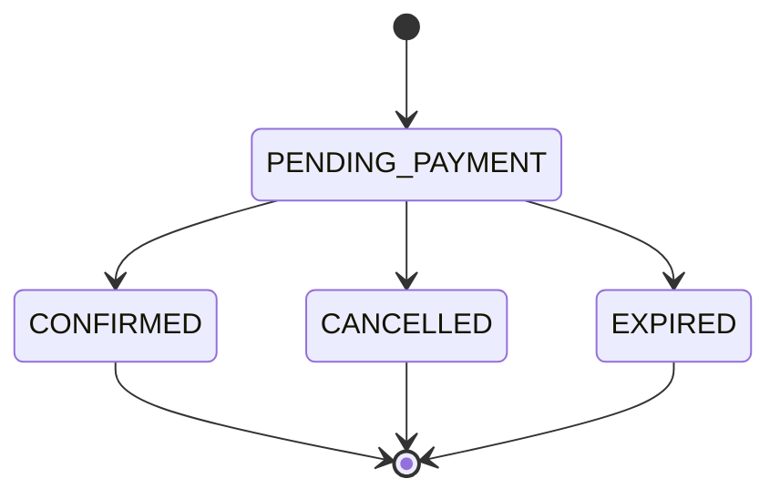
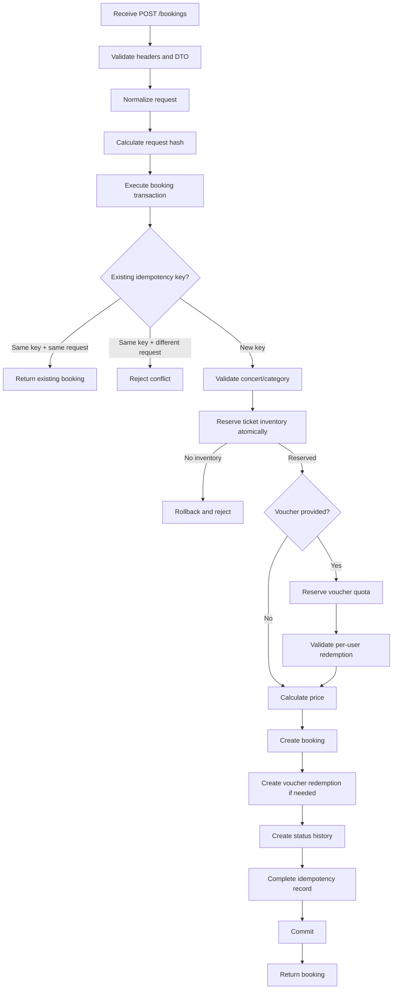
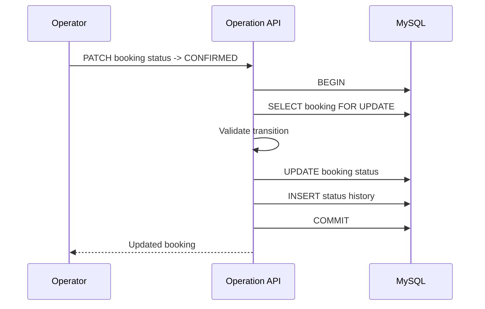
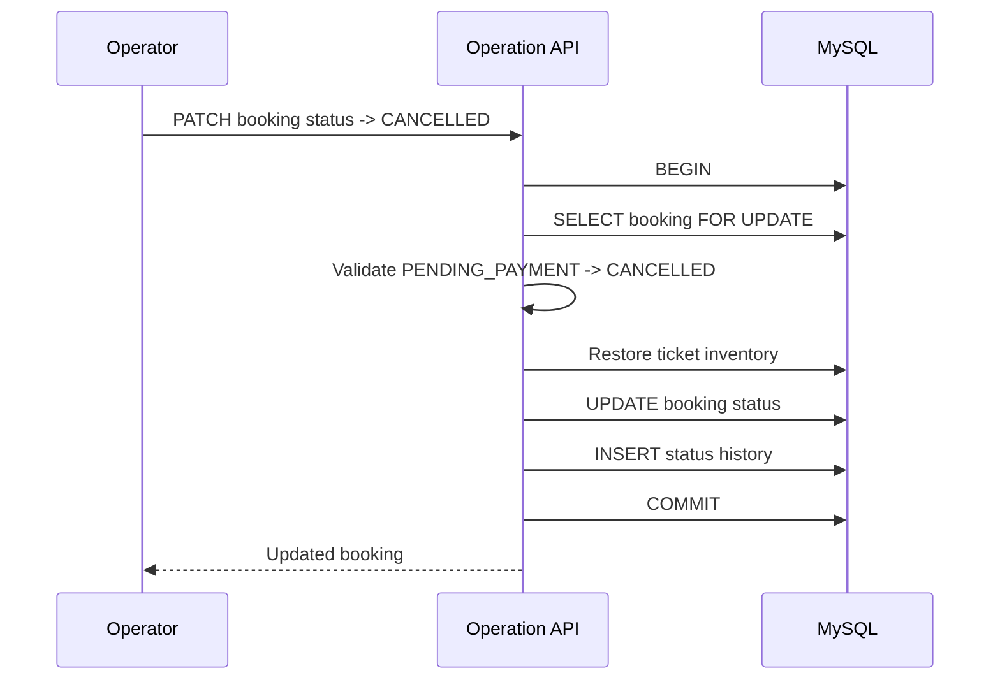
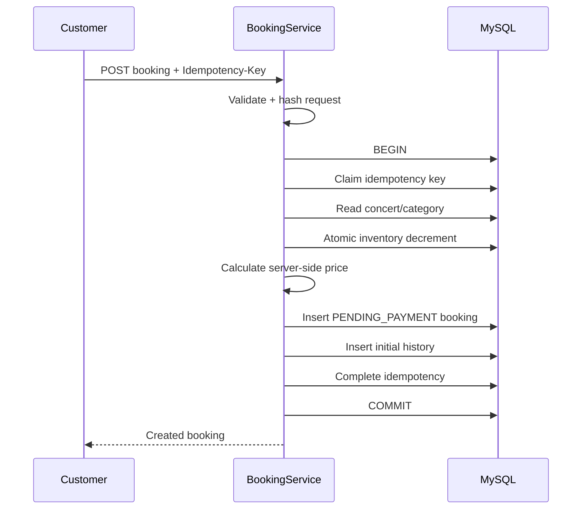
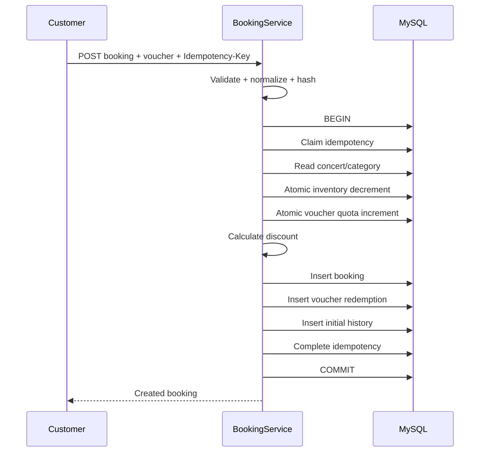
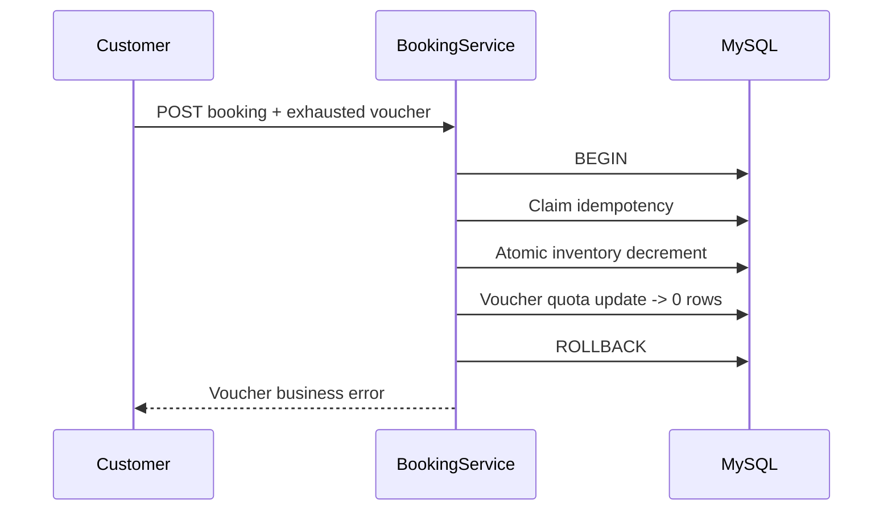
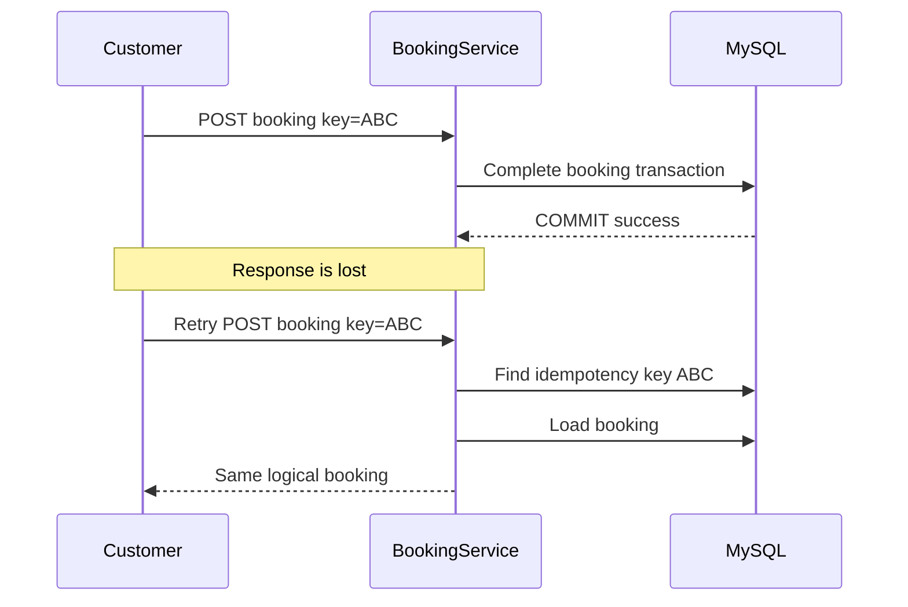
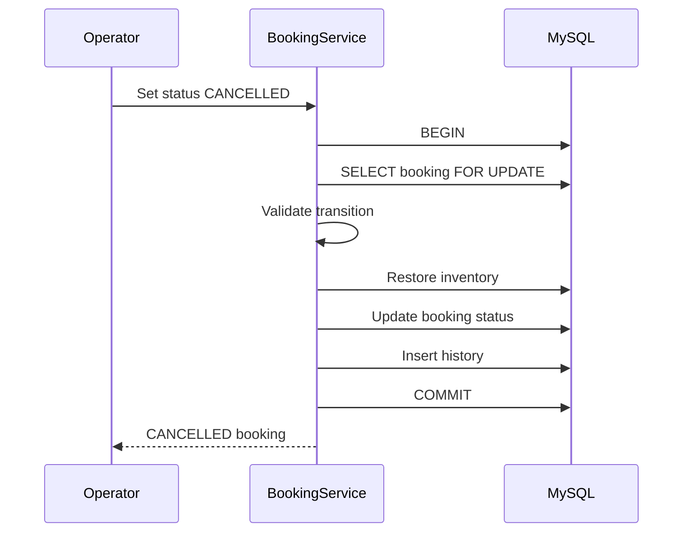

# 03 — Booking Workflow

## 1. Purpose

This document defines the end-to-end booking workflow for the **Concert Ticket Booking Platform**.

It focuses on the backend behaviors that matter most for the technical assessment:

- Ticket reservation must not oversell.
- Retried requests must not create duplicate bookings.
- Voucher usage must remain correct under concurrency.
- Booking creation must be atomic.
- Invalid booking state transitions must be rejected.
- Cancelled/expired reservations must release ticket inventory exactly once.
- The workflow must remain understandable and testable under flash-sale traffic.

This document is intentionally implementation-oriented so it can be used as the reference when coding the `bookings` module.

---

# 2. Scope of the Booking Workflow

For the current assessment scope:

```text
one booking
= one customer
+ one concert
+ one ticket category
+ one quantity
+ zero or one voucher
```

A booking request does not contain:

```text
authoritative ticket price
authoritative discount
authoritative total amount
booking status
```

Those values are calculated or controlled by the backend.

---

# 3. Main Booking Actors

```text
Customer
Operator
Backend API
MySQL/InnoDB
```

### Customer

Can:

```text
create a booking
retry the same booking request safely
view booking details
view booking status
```

### Operator

Can:

```text
inspect bookings
confirm a pending booking
cancel a pending booking
expire a pending booking
```

The assessment does not require a real payment gateway, so operation-driven status changes represent the simplified payment/operation workflow.

---

# 4. Booking State Machine

The booking state machine is intentionally small.



## Initial state

Every successfully created booking begins as:

```text
PENDING_PAYMENT
```

## Allowed transitions

```text
PENDING_PAYMENT -> CONFIRMED
PENDING_PAYMENT -> CANCELLED
PENDING_PAYMENT -> EXPIRED
```

## Terminal states

```text
CONFIRMED
CANCELLED
EXPIRED
```

Terminal bookings cannot transition again within the assessment scope.

---

# 5. Booking State Effects

| Transition | Ticket inventory | Voucher quota | Booking history |
|---|---|---|---|
| Create -> `PENDING_PAYMENT` | Decrease | Consume if applied | Insert initial entry |
| `PENDING_PAYMENT` -> `CONFIRMED` | No change | No change | Insert transition |
| `PENDING_PAYMENT` -> `CANCELLED` | Restore | No restoration | Insert transition |
| `PENDING_PAYMENT` -> `EXPIRED` | Restore | No restoration | Insert transition |

## Voucher decision

For this assessment:

```text
voucher quota is consumed at successful reservation time
```

If the booking later becomes:

```text
CANCELLED
EXPIRED
```

the voucher is **not restored**.

This is an explicit scope assumption.

A real production product may implement a different voucher restoration policy.

---

# 6. Booking API Contract — Conceptual

The final HTTP schema is defined in the API design document, but the core request concept is:

```http
POST /api/v1/bookings
Idempotency-Key: <client-generated-key>
```

Example body:

```json
{
  "concertId": 1,
  "ticketCategoryId": 2,
  "quantity": 2,
  "voucherCode": "GEEK10"
}
```

`voucherCode` is optional.

---

# 7. Server-Trusted vs. Client-Provided Data

## Client may provide

```text
concertId
ticketCategoryId
quantity
voucherCode
Idempotency-Key
```

## Client must not control

```text
unitPrice
subtotal
discountAmount
totalAmount
bookingStatus
voucherUsedCount
availableQuantity
```

All financial and state-changing values are calculated from authoritative server/database data.

---

# 8. Top-Level Booking Workflow



---

# 9. Request Validation Before Transaction

Cheap validation should happen before opening the transaction.

Examples:

```text
Idempotency-Key is present
Idempotency-Key length is valid
concertId is valid
ticketCategoryId is valid
quantity is integer
quantity >= 1
quantity <= 10
voucherCode length is valid if provided
```

These checks do not require database locks.

### Why

Opening a database transaction for obviously invalid input wastes connections and lock time.

---

# 10. Request Normalization

Before calculating the idempotency hash:

```text
voucherCode:
trim
convert to uppercase

numeric IDs:
use normalized integer representation

quantity:
use normalized integer representation
```

The normalized request is the semantic request used for hashing.

---

# 11. Request Hash

The server calculates:

```text
SHA-256(canonical booking request)
```

Conceptual canonical payload:

```json
{
  "userId": 101,
  "concertId": 1,
  "ticketCategoryId": 2,
  "quantity": 2,
  "voucherCode": "GEEK10"
}
```

If no voucher exists:

```json
{
  "userId": 101,
  "concertId": 1,
  "ticketCategoryId": 2,
  "quantity": 2,
  "voucherCode": null
}
```

---

# 12. Why the User ID Is Part of the Hash Context

Idempotency is scoped to:

```text
(user_id, idempotency_key)
```

The same raw key used by two different users represents two independent requests.

The user ID is therefore part of the logical identity/context of the request.

---

# 13. Idempotency Behavior

## Case A — First request

```text
no existing (user_id, key)
```

The request may proceed.

---

## Case B — Retry with same key and same payload

```text
existing request_hash == current request_hash
```

Expected:

```text
return the same logical booking result
do not decrement inventory again
do not consume voucher quota again
```

---

## Case C — Same key with different payload

Example:

First request:

```json
{
  "ticketCategoryId": 2,
  "quantity": 2
}
```

Retry:

```json
{
  "ticketCategoryId": 2,
  "quantity": 3
}
```

Expected:

```text
IDEMPOTENCY_KEY_CONFLICT
```

Do not silently reinterpret the second request.

---

# 14. Idempotency Database Protection

The database enforces:

```text
UNIQUE(user_id, idempotency_key)
```

This is required because two requests may arrive at the same time.

Application logic such as:

```text
SELECT
if missing:
    INSERT
```

without a unique constraint is not concurrency-safe.

---

# 15. Idempotency Transaction Strategy

The idempotency record participates in the booking transaction.

Conceptually:

```text
BEGIN

INSERT idempotency record as PROCESSING

... booking work ...

UPDATE idempotency record
SET status = COMPLETED,
    booking_id = created booking

COMMIT
```

If any booking step fails:

```text
ROLLBACK
```

The new idempotency row also rolls back.

This means a later retry is free to try again.

---

# 16. Concurrent Same-Key Requests

Assume:

```text
Request A
Request B

same user
same idempotency key
same payload
```

Possible sequence:

```text
A inserts unique idempotency row
B tries to insert same unique identity
B waits for A's transaction result
A completes booking and commits
B receives duplicate-key outcome
B reads the committed idempotency record
B compares request hash
B returns A's booking
```

Final state:

```text
1 booking
1 inventory deduction
1 voucher consumption
1 idempotency record
```

---

# 17. If the First Same-Key Request Rolls Back

Example:

```text
A reserves inventory
A later fails
A transaction rolls back
```

Then:

```text
inventory rollback
voucher rollback
booking rollback
idempotency insert rollback
```

Request B or a later retry may process normally.

No permanently stuck `PROCESSING` record is created by the rolled-back transaction.

---

# 18. Critical Booking Transaction

The core transaction is:

```text
BEGIN

1. Claim/resolve idempotency key

2. Read authoritative concert/category metadata

3. Validate:
   - concert exists
   - concert is PUBLISHED
   - ticket category exists
   - category belongs to requested concert

4. Atomically reserve ticket inventory

5. If voucher exists:
   - atomically reserve global voucher quota
   - obtain voucher rule/value
   - later enforce per-user redemption uniqueness

6. Calculate:
   - unit price
   - subtotal
   - discount
   - total

7. Insert booking

8. If voucher exists:
   - insert voucher_redemption

9. Insert initial booking_status_history

10. Mark idempotency record COMPLETED + booking_id

COMMIT
```

Any required failure causes:

```text
ROLLBACK
```

---

# 19. Stable Lock Ordering

To reduce unnecessary deadlocks, booking transactions should acquire critical resources in a consistent order.

Preferred order:

```text
idempotency identity
        ↓
ticket category inventory row
        ↓
voucher row if present
        ↓
booking-related inserts
```

Every booking follows the same general resource order.

This reduces lock-order inversions.

---

# 20. Concert and Ticket Category Validation

Before inventory is changed, the backend verifies:

```text
concert exists
concert.status == PUBLISHED
ticket category exists
ticket_category.concert_id == requested concertId
```

If any check fails:

```text
rollback / reject
```

Possible errors:

```text
CONCERT_NOT_FOUND
CONCERT_NOT_PUBLISHED
TICKET_CATEGORY_NOT_FOUND
TICKET_CATEGORY_NOT_IN_CONCERT
```

---

# 21. Ticket Inventory Reservation

The critical inventory operation is an atomic conditional update.

Conceptually:

```sql
UPDATE ticket_categories
SET available_quantity = available_quantity - :quantity
WHERE id = :ticketCategoryId
  AND available_quantity >= :quantity;
```

Result:

```text
affectedRows = 1
→ inventory reserved

affectedRows = 0
→ insufficient inventory
```

---

# 22. Why No Separate Availability SELECT Decides the Reservation

Unsafe pattern:

```text
Request A reads available = 1
Request B reads available = 1

A decides success
B decides success
```

The authoritative reservation decision must happen in the write statement itself.

A prior read may be used for display or metadata, but not as the final concurrency guarantee.

---

# 23. Final Ticket Example

Initial:

```text
VIP available_quantity = 1
```

Two users concurrently request one ticket.

Database behavior:

```text
A UPDATE ... WHERE available_quantity >= 1
B UPDATE ... WHERE available_quantity >= 1
```

Expected final state:

```text
one request updates 1 row
one request updates 0 rows
available_quantity = 0
```

Never:

```text
available_quantity = -1
```

---

# 24. Voucher Validation Workflow

If `voucherCode` is provided:

```text
normalize voucher code
        ↓
attempt concurrency-safe voucher reservation
        ↓
obtain voucher rule
        ↓
calculate discount
        ↓
insert voucher redemption
```

Voucher checks conceptually include:

```text
voucher exists
status == ACTIVE
current UTC time >= starts_at
current UTC time < ends_at
used_count < usage_limit
```

---

# 25. Voucher Global Quota Reservation

Conceptually:

```sql
UPDATE vouchers
SET used_count = used_count + 1
WHERE code = :voucherCode
  AND status = 'ACTIVE'
  AND starts_at <= UTC_TIMESTAMP(3)
  AND ends_at > UTC_TIMESTAMP(3)
  AND used_count < usage_limit;
```

Interpretation:

```text
affectedRows = 1
→ one quota unit reserved

affectedRows = 0
→ voucher cannot be used
```

Because this occurs inside the booking transaction, later failure rolls the increment back.

---

# 26. Voucher Per-User Protection

The database enforces:

```text
UNIQUE(voucher_id, user_id)
```

in:

```text
voucher_redemptions
```

This guarantees that two concurrent requests from the same user cannot both successfully consume the same voucher.

---

# 27. Voucher Race Example

Voucher:

```text
usage_limit = 10
used_count = 9
```

Two eligible users:

```text
A
B
```

Both attempt to use the final quota unit.

Expected:

```text
one voucher UPDATE succeeds
one voucher UPDATE affects 0 rows
used_count = 10
```

No 11th redemption can commit.

---

# 28. Same-User Voucher Race Example

User submits two different booking requests concurrently:

```text
Request A → Idempotency-Key A
Request B → Idempotency-Key B

same voucher
same user
```

Possible sequence:

```text
both may reach voucher processing
one voucher_redemption INSERT succeeds
the other violates UNIQUE(voucher_id, user_id)
```

The losing transaction rolls back:

```text
ticket deduction
voucher counter increment
booking insert
idempotency row
```

Final guarantee:

```text
maximum one successful voucher redemption
```

---

# 29. Price Calculation

Price is calculated entirely by the backend.

```text
unit_price = ticket_category.price
subtotal   = unit_price × quantity
```

If no voucher:

```text
discount_amount = 0
total_amount = subtotal
```

If voucher:

```text
discount_amount = calculateVoucherDiscount(...)
total_amount = max(subtotal - discount_amount, 0)
```

---

# 30. Percentage Voucher Calculation

Example:

```text
subtotal = 2,000,000
voucher = 10%
```

Then:

```text
discount = 200,000
total = 1,800,000
```

The exact decimal rounding rule should be implemented once in a dedicated pricing function and covered by unit tests.

---

# 31. Fixed Amount Voucher Calculation

Example:

```text
subtotal = 300,000
fixed discount = 500,000
```

The total must not become negative.

```text
discount_amount = min(500,000, 300,000)
total_amount = 0
```

Persisted discount must satisfy:

```text
discount_amount <= subtotal
```

---

# 32. Price Snapshot

The booking stores:

```text
unit_price
subtotal
discount_amount
total_amount
```

These values are snapshots.

If ticket category price changes later:

```text
old booking financial data does not change
```

---

# 33. Booking Creation

After all critical reservations and calculations succeed:

```text
INSERT booking
status = PENDING_PAYMENT
```

The booking contains:

```text
user_id
concert_id
ticket_category_id
quantity
unit_price
subtotal
discount_amount
total_amount
status
expires_at
```

---

# 34. Initial Booking History

The same transaction inserts:

```text
from_status = NULL
to_status = PENDING_PAYMENT
```

This provides a complete state audit trail starting at creation.

---

# 35. Completing the Idempotency Record

Before transaction commit:

```text
status = COMPLETED
booking_id = created booking ID
```

Then:

```text
COMMIT
```

The booking and its idempotency result become durable together.

---

# 36. Successful Booking Response

After commit, the API returns the booking.

Conceptual response:

```json
{
  "id": 123,
  "concertId": 1,
  "ticketCategoryId": 2,
  "quantity": 2,
  "unitPrice": "1000000.00",
  "subtotal": "2000000.00",
  "discountAmount": "200000.00",
  "totalAmount": "1800000.00",
  "status": "PENDING_PAYMENT",
  "expiresAt": "2026-08-08T08:30:00.000Z"
}
```

Exact API schema is finalized later.

---

# 37. Why Response Happens After Commit

The API must not return:

```text
booking success
```

before the database commit succeeds.

Otherwise:

```text
client receives success
database later rolls back
```

which is unacceptable.

---

# 38. Client Timeout After Commit

Scenario:

```text
database COMMIT succeeds
network response is lost
client times out
```

The booking exists.

Client retries using the same:

```text
Idempotency-Key
```

The server finds:

```text
COMPLETED idempotency record
same request hash
booking_id present
```

and returns the existing booking.

No second reservation occurs.

---

# 39. Failure Before Commit

Scenario:

```text
ticket reserved
voucher reserved
booking inserted
database error occurs before commit
```

Expected:

```text
ROLLBACK
```

Final database state must look as if the transaction never happened.

---

# 40. Failure Matrix

| Failure | Expected result |
|---|---|
| Invalid DTO | Reject before transaction |
| Missing idempotency key | Reject before booking work |
| Concert not found | Rollback/reject |
| Concert not published | Rollback/reject |
| Category not found | Rollback/reject |
| Category belongs to another concert | Rollback/reject |
| Insufficient ticket inventory | Rollback/reject |
| Voucher invalid | Rollback ticket reservation |
| Voucher quota exhausted | Rollback ticket reservation |
| Same-user voucher uniqueness failure | Rollback all writes |
| Booking insert failure | Rollback inventory/voucher/idempotency |
| History insert failure | Rollback booking |
| Idempotency completion failure | Rollback booking |
| Commit failure | Treat booking as not confirmed by API; retry semantics handled by idempotency/database result |
| Response lost after successful commit | Retry returns same booking |

---

# 41. Error Classification

Errors should be classified into:

```text
validation errors
business conflicts
not-found errors
transient infrastructure errors
unexpected internal errors
```

Examples:

### Validation

```text
INVALID_TICKET_QUANTITY
INVALID_IDEMPOTENCY_KEY
```

### Not found

```text
CONCERT_NOT_FOUND
TICKET_CATEGORY_NOT_FOUND
VOUCHER_NOT_FOUND
BOOKING_NOT_FOUND
```

### Business conflict

```text
CONCERT_NOT_PUBLISHED
INSUFFICIENT_TICKET_INVENTORY
VOUCHER_USAGE_LIMIT_REACHED
VOUCHER_ALREADY_USED
IDEMPOTENCY_KEY_CONFLICT
INVALID_BOOKING_STATUS_TRANSITION
```

### Transient infrastructure

```text
database lock timeout
deadlock retry budget exhausted
temporary database unavailability
```

---

# 42. Suggested HTTP Mapping

The final API document may refine these mappings.

| Error type | Suggested HTTP status |
|---|---:|
| Invalid input | `400` |
| Not authenticated, if added later | `401` |
| Not authorized, if added later | `403` |
| Resource not found | `404` |
| Business conflict | `409` |
| Unexpected internal error | `500` |
| Temporary dependency unavailable | `503` |

---

# 43. Deadlock Handling

Deadlocks can occur legitimately under concurrent database transactions.

Recommended booking behavior:

```text
execute transaction
        ↓
deadlock?
        ↓ yes
rollback automatically
        ↓
small randomized backoff
        ↓
retry transaction
```

Retry policy:

```text
maximum transaction retries: 2
```

The exact code should identify MySQL deadlock errors explicitly.

Do not retry every business failure.

---

# 44. What Is Retryable

Potentially retryable internally:

```text
MySQL deadlock
specific transient lock conflict
```

Not internally retryable as transaction failures:

```text
insufficient inventory
voucher exhausted
voucher already used
concert not published
idempotency payload conflict
invalid quantity
```

These are deterministic business outcomes.

---

# 45. Why Retry Count Is Bounded

Unlimited retry can create:

```text
long request latency
database pressure
retry storms
hidden failures
```

A small bounded retry policy provides resilience without turning contention into an infinite loop.

---

# 46. Transaction Timeout Principle

A booking transaction should be short.

Avoid:

```text
sleep
network request
external API
email
SMS
payment provider call
large unrelated query
```

inside it.

The transaction should perform only the minimum database work required for a consistent booking.

---

# 47. Booking Confirmation Workflow

Operation request:

```text
PENDING_PAYMENT -> CONFIRMED
```

Workflow:



Inventory is unchanged because it was reserved at booking creation.

---

# 48. Booking Cancellation Workflow

Operation request:

```text
PENDING_PAYMENT -> CANCELLED
```

Workflow:



---

# 49. Booking Expiration Workflow

For the initial assessment, automatic scheduling may be deferred.

The state transition is still modeled:

```text
PENDING_PAYMENT -> EXPIRED
```

The transaction is equivalent to cancellation:

```text
lock booking
validate transition
restore ticket inventory
update status
insert history
commit
```

---

# 50. Why `SELECT ... FOR UPDATE` Is Used for Status Changes

Without a row lock:

```text
Operator A reads PENDING_PAYMENT
Operator B reads PENDING_PAYMENT

A cancels and restores inventory
B expires and restores inventory
```

Inventory could be restored twice.

With:

```sql
SELECT ...
FROM bookings
WHERE id = ?
FOR UPDATE;
```

one transition obtains the row lock first.

The second request waits and then sees the already-changed terminal state.

It cannot legitimately release inventory again.

---

# 51. Concurrent Cancellation Example

Initial:

```text
booking.status = PENDING_PAYMENT
available_quantity = 5
booking.quantity = 2
```

Requests:

```text
A -> CANCELLED
B -> CANCELLED
```

Expected:

```text
A locks booking
A restores inventory: 5 -> 7
A sets CANCELLED
A commits

B acquires lock
B sees CANCELLED
B transition rejected/no-op according to API rule
```

Final:

```text
available_quantity = 7
```

Not:

```text
9
```

---

# 52. Concurrent Confirm vs. Cancel

Initial:

```text
PENDING_PAYMENT
```

Requests:

```text
A -> CONFIRMED
B -> CANCELLED
```

The booking row lock serializes them.

Possible outcome:

```text
A commits CONFIRMED
B later sees CONFIRMED
B cannot CANCEL
```

or:

```text
B commits CANCELLED
A later sees CANCELLED
A cannot CONFIRM
```

Exactly one valid terminal outcome wins.

---

# 53. Inventory Restoration Statement

Conceptually:

```sql
UPDATE ticket_categories
SET available_quantity = available_quantity + :quantity
WHERE id = :ticketCategoryId;
```

This runs only after the booking row has been locked and the current transition has been validated.

---

# 54. Inventory Restoration Safety

The workflow must preserve:

```text
available_quantity <= total_quantity
```

The design prevents duplicate release by locking and state validation.

The database `CHECK` constraint acts as an additional backstop.

---

# 55. Voucher Behavior on Cancellation

For this assessment:

```text
booking cancelled
→ ticket inventory restored
→ voucher redemption remains
→ voucher used_count remains consumed
```

This decision avoids:

```text
redeem voucher
cancel
redeem again
cancel
repeat
```

and keeps voucher semantics conservative.

---

# 56. Booking Expiration Time

If an expiration time is implemented, it is assigned by the server.

Example concept:

```text
expires_at = created_at + configured reservation window
```

The client does not choose `expires_at`.

The exact reservation duration should be configuration rather than hard-coded throughout the codebase.

---

# 57. Automatic Expiration — Optional Extension

If time allows, an expiration worker could periodically find:

```text
PENDING_PAYMENT
AND expires_at <= now
```

and invoke the same domain transition used by operation APIs.

Important rule:

> Do not create a separate unsafe inventory-release path.

Automatic expiration and manual expiration should reuse the same transition service.

---

# 58. Safe Expiration Query Pattern

A production-grade worker must consider concurrent workers.

That is outside the minimum scope.

If implemented in this assessment, it should still rely on:

```text
booking row locking
valid state transition
same inventory release transaction
```

rather than assuming a query result remains current.

---

# 59. Read Booking Workflow

Customer request:

```text
GET /api/v1/bookings/:id
```

Checks:

```text
booking exists
booking belongs to requesting customer
```

Then return authoritative booking state.

Full authentication is outside scope, so test identity may be supplied through the project's simplified actor mechanism.

---

# 60. Customer Booking List

```text
GET /api/v1/me/bookings
```

Uses bounded pagination.

Query pattern:

```text
WHERE user_id = current user
ORDER BY created_at DESC, id DESC
```

No transaction is required for a normal list read.

---

# 61. Operation Booking List

```text
GET /api/v1/ops/bookings
```

May support filters such as:

```text
status
concertId
userId
```

Only filters justified by implemented indexes should be added.

Avoid building an over-general dynamic query engine for the assessment.

---

# 62. Operation Booking Detail

Operation detail should include enough information to reason about failures:

```text
booking
concert
ticket category
customer
voucher redemption if any
status history
```

This is valuable for the requirement to handle failed/suspicious bookings operationally, even though a full fraud system is out of scope.

---

# 63. Suspicious Booking Scope

The assessment mentions handling suspicious bookings.

The initial implementation does not create a fraud-scoring system.

Instead, the operation workflow provides:

```text
booking inspection
status inspection
voucher usage information
manual valid status update
status history
```

This is explicitly documented as a scope decision.

---

# 64. Booking Service Responsibilities

The `BookingsService` / booking application use case should own:

```text
create booking orchestration
idempotency coordination
transaction boundary
price snapshot creation
state transition validation
inventory restoration coordination
booking queries
```

It should not expose database transaction details to HTTP controllers.

---

# 65. Concerts Module Responsibilities During Booking

The concerts/inventory portion owns or exposes:

```text
read category metadata
validate concert/category relationship
atomic inventory reservation
inventory release
```

The exact module method boundary should remain simple and should avoid circular dependencies.

---

# 66. Vouchers Module Responsibilities During Booking

Voucher logic owns:

```text
voucher normalization
voucher rule validation
quota reservation
discount calculation
redemption persistence rules
```

The booking use case orchestrates this logic within one database transaction.

---

# 67. Repository / Database Access Principle

Repository methods used on the critical path must accept/use the same transaction context.

Forbidden architecture:

```text
BookingService transaction
    ↓
VoucherRepository opens separate transaction
    ↓
InventoryRepository uses default connection
```

That would break atomicity.

All booking-critical writes must participate in the same MySQL transaction.

---

# 68. Transaction Context Principle

Conceptually:

```text
transaction client/context
      ↓
inventory repository
voucher repository
booking repository
idempotency repository
history repository
```

All writes are committed or rolled back together.

---

# 69. ORM Considerations

If Prisma is used, standard ORM methods are suitable for normal CRUD/read operations.

For concurrency-sensitive operations, use:

```text
Prisma interactive transaction
+
raw SQL where needed
```

Examples where raw SQL may be clearer/correct:

```text
atomic inventory decrement
atomic voucher increment
SELECT ... FOR UPDATE
```

Do not force every operation through a high-level ORM abstraction if it weakens correctness.

---

# 70. Pseudocode — Create Booking

```text
function createBooking(userId, idempotencyKey, input):

    validateInput(input)
    normalizedInput = normalize(input)
    requestHash = sha256(canonical(userId, normalizedInput))

    return executeWithDeadlockRetry(() =>
        database.transaction(tx =>

            idem = claimOrResolveIdempotency(
                tx,
                userId,
                idempotencyKey,
                requestHash
            )

            if idem.isCompleted:
                return loadExistingBooking(tx, idem.bookingId)

            concert, category = loadBookingMetadata(tx, input)

            assert concert exists
            assert concert.status == PUBLISHED
            assert category exists
            assert category.concertId == concert.id

            reserved = reserveInventoryAtomically(
                tx,
                category.id,
                input.quantity
            )

            if !reserved:
                throw INSUFFICIENT_TICKET_INVENTORY

            discount = 0
            voucher = null

            if input.voucherCode exists:
                voucher = reserveVoucherQuotaAtomically(
                    tx,
                    normalizeVoucher(input.voucherCode)
                )

                if voucher cannot be reserved:
                    throw VOUCHER_NOT_AVAILABLE

                discount = calculateDiscount(
                    category.price,
                    input.quantity,
                    voucher
                )

            subtotal = category.price * input.quantity
            total = max(subtotal - discount, 0)

            booking = insertBooking(
                tx,
                price snapshots,
                PENDING_PAYMENT
            )

            if voucher exists:
                insertVoucherRedemption(
                    tx,
                    voucher.id,
                    userId,
                    booking.id,
                    discount
                )

            insertStatusHistory(
                tx,
                booking.id,
                null,
                PENDING_PAYMENT
            )

            completeIdempotency(
                tx,
                idem.id,
                booking.id
            )

            return booking
        )
    )
```

---

# 71. Pseudocode — Change Booking Status

```text
function changeStatus(operatorId, bookingId, targetStatus, reason):

    return executeWithDeadlockRetry(() =>
        database.transaction(tx =>

            booking = selectBookingForUpdate(tx, bookingId)

            if booking missing:
                throw BOOKING_NOT_FOUND

            assertValidTransition(
                booking.status,
                targetStatus
            )

            if targetStatus in [CANCELLED, EXPIRED]:
                restoreInventory(
                    tx,
                    booking.ticketCategoryId,
                    booking.quantity
                )

            updateBookingStatus(
                tx,
                booking.id,
                targetStatus
            )

            insertStatusHistory(
                tx,
                booking.id,
                booking.status,
                targetStatus,
                operatorId,
                reason
            )

            return updated booking
        )
    )
```

---

# 72. Idempotency Pseudocode — Conceptual

```text
function claimOrResolveIdempotency(tx, userId, key, hash):

    try:
        insert(
            userId,
            key,
            hash,
            PROCESSING
        )

        return NEW

    catch UNIQUE_CONSTRAINT:
        existing = select by (userId, key)

        if existing.requestHash != hash:
            throw IDEMPOTENCY_KEY_CONFLICT

        if existing.status == COMPLETED:
            return COMPLETED(existing.bookingId)

        // In the chosen transaction approach, concurrent insert
        // resolution normally observes the winning transaction
        // after its unique-key lock is resolved.

        return resolve according to committed row state
```

Exact ORM/MySQL behavior must be verified with an integration test rather than assumed.

---

# 73. Important Idempotency Test Requirement

Idempotency correctness must be tested against **real MySQL/InnoDB**, not only mocks.

Why:

```text
unique-index locking
transaction visibility
concurrent insert behavior
```

are database behaviors.

A unit test cannot prove those guarantees.

---

# 74. Response Replay Policy

For the assessment, same-key retry needs to return the same logical booking.

It is not necessary to persist the complete serialized HTTP response.

Persisting:

```text
booking_id
```

is enough because the server can load the booking and return the current canonical representation.

Trade-off:

```text
response representation may evolve
```

but the same logical booking identity remains stable.

---

# 75. Idempotency Key Retention

The initial assessment keeps idempotency records without implementing cleanup.

Production could introduce a retention policy such as:

```text
delete/archive old keys after a business-defined duration
```

but this is out of scope.

---

# 76. Request Retry by Client

Clients should retry with:

```text
the same Idempotency-Key
the same semantic request body
```

They must not generate a new key for the same logical booking retry.

A new key means:

```text
new logical booking attempt
```

---

# 77. Duplicate Click Scenario

Customer double-clicks "Book":

```text
request A key = abc
request B key = abc
```

Safe:

```text
one logical booking
```

If the frontend generates two different keys:

```text
abc
xyz
```

the server treats them as two separate booking attempts.

That is expected idempotency semantics.

---

# 78. Why Idempotency Is Not the Same as "One Booking Per User"

The system does not impose:

```text
one booking per customer per concert
```

unless business requirements say so.

A customer may legitimately create multiple independent bookings using different idempotency keys.

Idempotency only deduplicates retries of the same logical request.

---

# 79. Inventory and Voucher Atomicity Example

Initial:

```text
tickets available = 10
voucher quota remaining = 0
```

Customer requests:

```text
2 tickets + voucher
```

Possible internal sequence:

```text
ticket reservation temporarily changes 10 -> 8
voucher update fails
transaction rolls back
```

Final:

```text
tickets available = 10
booking count unchanged
```

This scenario must have an integration test.

---

# 80. Voucher Unique Failure Rollback Example

Initial:

```text
tickets = 10
voucher quota remaining = 5
user has already used voucher
```

Request:

```text
ticket decrement 10 -> 9
voucher counter 5 -> 4 remaining
redemption INSERT violates unique constraint
```

Transaction rollback produces:

```text
tickets = 10
voucher quota remaining = 5
no new booking
```

---

# 81. Server Crash Before Commit

If the Node.js process crashes before MySQL commit:

```text
InnoDB transaction is not committed
connection closes
database rolls back
```

No successful booking should be exposed as committed.

---

# 82. Server Crash After Commit

If commit succeeds and the process crashes before sending the response:

```text
booking remains durable
idempotency record remains durable
```

Client retry safely retrieves the same booking.

This is one of the main reasons idempotency is part of the design.

---

# 83. Database Unavailable Before Transaction

If MySQL is unavailable:

```text
return transient infrastructure failure
```

Do not create a temporary in-memory booking.

Do not decrement any memory-only inventory.

The client may retry later with the same idempotency key.

---

# 84. Logging on Booking Creation

Useful structured log fields:

```text
requestId
userId
concertId
ticketCategoryId
quantity
bookingId
result
businessErrorCode
transactionRetryCount
```

Avoid logging:

```text
full sensitive request details
secrets
database credentials
```

For the idempotency key, log a safe reference/hash rather than blindly logging arbitrary client input.

---

# 85. Booking Metrics — Future / Optional

Production metrics could include:

```text
booking_attempt_total
booking_success_total
booking_inventory_rejected_total
booking_voucher_rejected_total
booking_idempotent_replay_total
booking_transaction_deadlock_total
booking_transaction_duration
```

A full metrics stack is outside the assessment scope.

---

# 86. Concurrency Test — Overselling

## Setup

```text
VIP total_quantity = 100
VIP available_quantity = 100
```

## Load

Submit concurrent booking attempts whose requested total quantity exceeds 100.

Example:

```text
500 users
1 ticket each
```

## Expected assertions

```text
successful bookings = 100
failed due to inventory = 400
sum(successful booking quantities) = 100
available_quantity = 0
available_quantity never negative
```

---

# 87. Concurrency Test — Same Idempotency Key

## Setup

```text
inventory = 100
```

## Load

```text
20 concurrent HTTP requests
same user
same Idempotency-Key
same payload
quantity = 2
```

## Expected

```text
one booking row
successful logical result references same booking
available_quantity decreases by exactly 2
one idempotency row
```

---

# 88. Concurrency Test — Voucher Quota

## Setup

```text
voucher usage_limit = 10
used_count = 0
enough ticket inventory
```

## Load

```text
50 distinct eligible users
same voucher
concurrent booking requests
```

## Expected

```text
10 voucher-backed bookings succeed
voucher used_count = 10
10 voucher_redemption rows
quota never exceeded
```

Depending on API policy, losing requests may fail rather than continue without the requested voucher.

The chosen behavior should be explicit.

For this assessment:

> If the customer explicitly requests a voucher and it cannot be applied, the booking request fails rather than silently booking at full price.

---

# 89. Concurrency Test — Same User Voucher

## Setup

```text
voucher usage_limit is sufficient
same user
same voucher
different idempotency keys
```

## Load

```text
10 concurrent booking attempts
```

## Expected

```text
maximum one successful voucher redemption
all losing transactions leave no leaked inventory/counter changes
```

---

# 90. Concurrency Test — Cancel Twice

## Setup

```text
booking = PENDING_PAYMENT
quantity = 2
available_quantity = 10
```

## Load

```text
2 concurrent cancellation requests
```

## Expected

```text
one valid transition
inventory final = 12
not 14
booking final = CANCELLED
```

---

# 91. Concurrency Test — Confirm vs. Cancel

## Setup

```text
booking = PENDING_PAYMENT
```

## Load

```text
CONFIRM and CANCEL concurrently
```

## Expected

Exactly one terminal transition succeeds.

If:

```text
CONFIRMED wins
```

inventory stays reserved.

If:

```text
CANCELLED wins
```

inventory is restored exactly once.

---

# 92. Integration Test — Voucher Failure Rolls Back Inventory

## Setup

```text
inventory = 10
voucher exhausted
```

## Request

```text
quantity = 2
voucher = exhausted voucher
```

## Expected

```text
HTTP business conflict
inventory = 10
booking does not exist
voucher counter unchanged
```

---

# 93. Integration Test — Idempotency Payload Conflict

First request:

```text
key = ABC
quantity = 1
```

Retry:

```text
key = ABC
quantity = 2
```

Expected:

```text
IDEMPOTENCY_KEY_CONFLICT
no second booking
no second inventory deduction
```

---

# 94. Integration Test — Draft Concert

```text
concert.status = DRAFT
```

Booking attempt expected:

```text
CONCERT_NOT_PUBLISHED
inventory unchanged
```

---

# 95. Integration Test — Category Mismatch

Request:

```text
concertId = Concert A
ticketCategoryId = category belonging to Concert B
```

Expected:

```text
TICKET_CATEGORY_NOT_IN_CONCERT
```

No inventory changes.

---

# 96. Integration Test — Historical Price

Create booking at:

```text
unit price = 1,000,000
```

Later update category price:

```text
1,200,000
```

Expected old booking:

```text
unit_price = 1,000,000
```

---

# 97. Unit Test — State Machine

Test every allowed transition:

```text
PENDING_PAYMENT -> CONFIRMED
PENDING_PAYMENT -> CANCELLED
PENDING_PAYMENT -> EXPIRED
```

Test invalid transitions:

```text
CONFIRMED -> CANCELLED
CONFIRMED -> PENDING_PAYMENT
CANCELLED -> CONFIRMED
EXPIRED -> CONFIRMED
```

---

# 98. Unit Test — Pricing

Cover:

```text
no voucher
percentage voucher
fixed voucher
fixed voucher greater than subtotal
rounding behavior
zero-discount impossible voucher data
```

---

# 99. Unit Test — Request Canonicalization

Equivalent semantic inputs should produce the same request hash.

Example:

```text
voucherCode = " geek10 "
voucherCode = "GEEK10"
```

After normalization:

```text
same semantic request
same hash
```

---

# 100. k6 Flash-Sale Scenario

The load test should not only report RPS.

It should be followed by database assertions.

Example:

```text
seed 100 VIP tickets
run 500 concurrent booking attempts
```

After the load:

```text
SELECT available_quantity
SELECT COUNT(successful bookings)
SELECT SUM(quantity)
```

The test passes only if the business invariant is preserved.

---

# 101. Booking Performance Principle

The critical path should minimize:

```text
number of DB round trips
transaction duration
locked row duration
unnecessary joins
unbounded queries
```

But correctness is never traded away for a premature micro-optimization.

---

# 102. Hot Row Consideration

During a flash sale, one popular ticket category can become a hot row.

That is expected.

The initial approach accepts this because:

```text
traffic is moderate
correctness is the main requirement
architecture remains simple
```

At much larger scale, the design may require:

```text
admission queue
sharded inventory buckets
reservation service
waiting room
```

Those are out of scope.

---

# 103. Voucher Hot Row Consideration

A globally popular voucher can similarly become a hot row because all redemptions update:

```text
used_count
```

This is acceptable for the assessment workload.

Future alternatives can be evaluated only if real contention requires them.

---

# 104. No Silent Voucher Fallback

If the customer requests:

```text
voucherCode = GEEK10
```

and the voucher fails:

```text
expired
exhausted
already used
inactive
```

the booking request fails.

The system does not silently remove the voucher and create a full-price booking.

### Reason

Silent fallback can charge the customer a different amount than expected.

---

# 105. No Client-Supplied Booking Status

Customer booking creation always sets:

```text
PENDING_PAYMENT
```

The client cannot submit:

```text
CONFIRMED
```

or any other state.

---

# 106. No Client-Supplied Discount

Even if a malicious client sends extra fields such as:

```json
{
  "discountAmount": 999999999
}
```

the DTO validation/whitelisting should reject or ignore unrecognized fields according to the final validation policy.

The server calculates all prices.

---

# 107. DTO Validation Policy

Recommended NestJS global validation:

```text
transform = true
whitelist = true
forbidNonWhitelisted = true
```

This prevents accidental or malicious extra fields from entering the application contract.

Exact implementation belongs to code setup.

---

# 108. Business Exception Principle

Expected business failures should use explicit application exceptions rather than raw database errors.

Example:

```text
MySQL duplicate voucher redemption
        ↓
translate
        ↓
VOUCHER_ALREADY_USED
```

Do not expose:

```text
raw SQL
table names
constraint stack traces
```

to API clients.

---

# 109. Unique Constraint Error Translation

Database constraints remain the final safety net, but the API should translate known constraint failures.

Examples:

```text
uq_idempotency_user_key
→ resolve idempotency flow

uq_voucher_redemptions_voucher_user
→ VOUCHER_ALREADY_USED

uq_voucher_redemptions_booking
→ internal invariant violation / defensive error
```

---

# 110. Transaction Retry and Idempotency Interaction

When an internal deadlock retry occurs:

```text
attempt 1 rolls back completely
attempt 2 re-executes same logical booking request
```

Because attempt 1 did not commit:

```text
no durable booking
no durable idempotency record from attempt 1
no durable inventory/voucher decrement
```

This makes transaction retry safe.

---

# 111. API-Level Retry and Idempotency Interaction

Internal transaction retry is different from client retry.

### Internal retry

```text
same HTTP request
backend re-runs rolled-back transaction
```

### Client retry

```text
new HTTP request
same Idempotency-Key
same payload
```

Both must remain safe.

---

# 112. Operation Status Idempotency

For the current scope, operation status-change endpoints do not require a separate Idempotency-Key.

The row lock and transition rules guarantee:

```text
no double inventory release
```

A repeated request to transition a terminal state will be rejected or treated as already transitioned according to the final API contract.

If operation commands later need network-level exactly-once semantics, idempotency can be added separately.

---

# 113. Booking Lookup After Idempotent Replay

When a completed idempotency key is replayed:

```text
load booking by booking_id
```

If the booking status has since changed:

```text
PENDING_PAYMENT -> CONFIRMED
```

the response may show the current booking representation:

```text
CONFIRMED
```

The guarantee is same logical booking, not frozen response bytes.

---

# 114. Consistency Level for Customer Reads

Immediately after the booking response is returned:

```text
the transaction has committed
```

A normal read against the same primary MySQL database can observe the committed booking.

The initial design does not introduce read replicas, so replica lag is not a concern.

---

# 115. Booking Audit History

History entries include:

```text
booking_id
from_status
to_status
changed_by_user_id
reason
created_at
```

This supports operation review without embedding all audit information into the booking row.

---

# 116. Status Reason

For manual operation transitions, `reason` is optional but recommended.

Examples:

```text
"payment confirmed manually"
"customer requested cancellation"
"reservation expired"
```

The API should bound its maximum length.

---

# 117. Operation Authorization Scope

Full RBAC is not implemented.

However, operation endpoints are separated under:

```text
/api/v1/ops/*
```

and test users can include:

```text
role = OPERATOR
```

This leaves a clear place to enforce guards if lightweight role validation is included.

---

# 118. Booking Workflow Non-Goals

This workflow does not implement:

```text
real payment gateway
payment webhook
refund
partial cancellation
partial ticket release
multiple categories in one booking
multiple vouchers in one booking
seat assignment
ticket transfer
voucher quota restoration
fraud scoring
distributed reservation service
```

These are intentional scope boundaries.

---

# 119. Future Payment Integration

If payment is added later, the booking state machine could evolve.

For example:

```text
PENDING_PAYMENT
    ↓
PAYMENT_PROCESSING
    ↓
CONFIRMED
```

Payment callbacks would need their own idempotency guarantees.

This is outside the current assessment implementation.

---

# 120. Future Multi-Item Booking

If a booking later supports multiple categories:

```text
bookings
booking_items
```

inventory rows should be locked/updated in deterministic order, for example by:

```text
ticket_category_id ASC
```

to reduce deadlock risk.

The current one-category assumption avoids this complexity.

---

# 121. Future Voucher Restoration

If product requirements later say:

```text
cancelled booking should restore voucher quota
```

the cancellation transaction would need to:

```text
lock booking
validate transition
restore inventory
decrement voucher used_count
mark/delete/reverse voucher redemption
update booking
insert history
commit
```

That lifecycle is deliberately not implemented now.

---

# 122. Implementation Checklist — Create Booking

Before marking `POST /bookings` complete:

```text
[ ] DTO validation works.
[ ] Idempotency-Key is required.
[ ] Request normalization is deterministic.
[ ] Request hash is deterministic.
[ ] Same key + changed payload conflicts.
[ ] Same key + same payload replays safely.
[ ] Concert must be PUBLISHED.
[ ] Category must belong to concert.
[ ] Price comes from MySQL.
[ ] Ticket inventory uses atomic conditional UPDATE.
[ ] Voucher quota uses concurrency-safe update.
[ ] Same-user voucher is protected by UNIQUE.
[ ] Booking stores price snapshots.
[ ] Booking starts at PENDING_PAYMENT.
[ ] Initial history is inserted.
[ ] Idempotency completion is committed with booking.
[ ] Any failure rolls everything back.
[ ] Deadlocks have bounded retry.
[ ] Known DB conflicts map to business errors.
```

---

# 123. Implementation Checklist — Change Status

```text
[ ] Booking is loaded with FOR UPDATE.
[ ] Current state is re-read inside transaction.
[ ] Transition matrix is enforced.
[ ] CONFIRMED does not alter inventory.
[ ] CANCELLED restores inventory once.
[ ] EXPIRED restores inventory once.
[ ] Voucher quota is not restored.
[ ] Booking update and inventory update share one transaction.
[ ] Status history is inserted in same transaction.
[ ] Concurrent terminal transitions cannot both succeed.
```

---

# 124. Test Checklist

```text
[ ] Overselling concurrency test.
[ ] Same-key concurrency test.
[ ] Same-key/different-payload test.
[ ] Voucher quota concurrency test.
[ ] Same-user voucher race test.
[ ] Voucher failure inventory rollback test.
[ ] Booking insert failure rollback test.
[ ] Draft concert rejection test.
[ ] Category mismatch test.
[ ] Price snapshot test.
[ ] State machine unit tests.
[ ] Concurrent cancellation test.
[ ] Confirm-vs-cancel concurrency test.
[ ] Deadlock retry test if reproducible/mockable at transaction wrapper level.
```

---

# 125. Core Invariant Matrix

| Invariant | Booking workflow mechanism | Proof |
|---|---|---|
| Inventory never negative | Atomic conditional inventory update | Concurrency test |
| No overselling | Database decides reservation in one update | Concurrency test |
| Retry does not duplicate booking | Idempotency key + unique constraint | Concurrent retry test |
| Voucher quota not exceeded | Atomic voucher counter update | Voucher concurrency test |
| Same user cannot reuse voucher | Unique redemption constraint | Same-user race test |
| Booking atomicity | Single InnoDB transaction | Rollback integration tests |
| Inventory released once | Booking row lock + transition state | Concurrent cancellation test |
| Invalid transitions rejected | Explicit state machine | Unit + integration tests |
| Prices cannot be client-forged | Server-side DB price lookup | API integration test |

---

# 126. Sequence — Successful Booking Without Voucher



---

# 127. Sequence — Successful Booking With Voucher



---

# 128. Sequence — Voucher Failure After Inventory Reservation



Final state:

```text
inventory unchanged
no booking
no idempotency completion
no voucher change
```

---

# 129. Sequence — Idempotent Retry After Lost Response



---

# 130. Sequence — Cancellation



---

# 131. Definition of Done

The booking workflow is considered correctly implemented when:

```text
1. Successful booking creation is fully transactional.

2. Inventory cannot become negative under concurrency.

3. Successful reservations cannot exceed available inventory.

4. Same-key retries do not create duplicate bookings.

5. Same key with a different request is rejected.

6. Voucher global quota cannot be exceeded.

7. One user cannot use the same voucher more than once.

8. Voucher failure cannot leak a ticket reservation.

9. Booking financial values are server-controlled snapshots.

10. Status transitions are explicit and validated.

11. Cancellation and expiration restore inventory exactly once.

12. Confirmation does not double-consume inventory.

13. Status history is written transactionally.

14. Deadlocks use a small bounded retry policy.

15. Critical guarantees are proven against real MySQL with integration/concurrency tests.
```

---

# 132. Final Booking Workflow Statement

The core booking path is intentionally designed around:

```text
Idempotency
+ atomic ticket reservation
+ atomic voucher reservation
+ server-side pricing
+ one ACID transaction
+ explicit state transitions
+ row locking for inventory release
+ automated concurrency tests
```

The most important rule is:

> **A booking is only successful when all required business state changes can be committed consistently together.**

The API should never report success for a partially created reservation, and concurrent requests must never be able to violate the system's ticket, voucher, or booking invariants.
